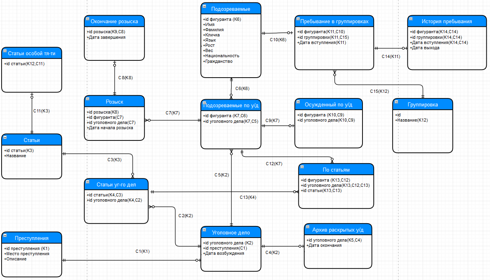

# Разработка и реализация базы данных "Картотека Интерпола"

Данная работа являлась частью учебной программы ВУЗа по предмету "Базы данных".

Ниже описаны постановка задачи, моделирование базы данных, наполнение и написание запросов на реляционной алгебре.  
Далее база данных была реализована на SQL в PostgreSql.  
В файле **creation.sql** происходит создание таблиц.  
В файле **datafilling.sql** происходит наполнение данными созданных таблиц.  
Затем в файле **queries.sql** реализованы запросы, которые изначально были написаны на реляционной алгебре.
 

## 1. Постановка задачи
   

  
<strong>1.1. Тема задачи и предметная область</strong>

  

    <strong><em>Картотека Интерпола</em></strong><strong>.</strong> Преступники. Преступления, виды преступлений. Места
    преступлений.
    Уголовное дело. Описания подозреваемых лиц. Розыск. Архив раскрытых преступлений.
  

  
<strong>1.2. Описание предметной области и требования к базе данных</strong>

  
1)Найти таких преступников, которые чаще других меняли преступную группировку.

  
2)Найти всех преступников с одинаковыми кличками, но владеющими разными языками.

  

    3)Какие преступники совершали преступления только в других странах (отличные от страны
    гражданства)?
  

  

    4)Найти таких преступников, которые могли бы быть похожими друг на друга по наибольшему числу
    физических параметров
  

  

    <strong>  </strong>
  

  
  ## 2. Моделирование базы данных
  
  
<strong>2.2. Схема ER-модели</strong>

 

  
<strong>2.3. Детализация ER-модели</strong>

  
<strong>2.3.1. Ключи</strong>

  <ul>
    <li>К1: Преступления (Номер преступления)</li>
    <li>К2: Уголовные дела (Номер уголовного дела)</li>
    <li>К3: Статьи (Номер статьи)</li>
    <li>К4: Статьи уголовных дел (Номер статьи, номер уголовного дела)</li>
    <li>К5: Архив раскрытых уголовных дел (уголовного дела)</li>
    <li>К6: Подозреваемые (Номер фигуранта)</li>
    <li>К7: Подозреваемые по уголовному делу (Номер фигуранта, номер уголовного дела)</li>
    <li>K8: Розыск (Номер розыска)</li>
    <li>K9: Окончания розысков (Номер розыска)</li>
    <li>K10: Осужденные по уголовному делу (Номер фигуранта, номер уголовного дела)</li>
    <li>
      K11: Пребывание в группировках (Номер фигуранта, название группировки, Дата вступления)
    </li>
    <li>K12: Группировка (Название группировки)</li>
    <li>K13: История пребывания (Номер фигуранта, номер группировки, дата вступления)</li>
  </ul>

  
<strong>2.3.2. Связи</strong>

  

    С1 [1-1]: "Уголовные дело" (Номер преступления) &rarr; "Преступления".K1 (Номер преступления)
  

  

    С2 [1-N]: "Статьи уголовных дел" (Номер уголовного дела) &rarr; "Уголовные дело".К2(Номер
    уголовного дела)
  

  
С3 [1-N]: "Статьи уголовных дел" (Номер статьи) &rarr; "Статьи".K3 (Номер статьи)

  

    С4 [1-1]: "Архив раскрытых у/д" (Номер уголовного дела) &rarr; "Уголовные дело".К2(Номер
    уголовного дела)
  

  

    С5 [1-N]: "Подозреваемые по у/д" (Номер уголовного дела) &rarr; &nbsp;"Уголовные дело".К2(Номер
    уголовного дела)
  

  

    С6 [1-N]: "Подозреваемые по у/д" (Номер фигуранта) &rarr;&nbsp; "Подозреваемые".К6(Номер
    фигуранта)
  

  

    С7 [1-N]: "Розыск" (Номер фигуранта, Номер уголовного дела) &rarr;&nbsp;
    "Подозреваемые".К7(Номер фигуранта, Номер уголовного дела)
  

  

    С8 [1-1]: "Окончание розыска" (Номер розыска) &rarr;&nbsp; " Подозреваемые по у/д ".К8(Номер
    розыска)
  

  

    С9 [1-1]: "Осужденный по у/д" " (Номер фигуранта, Номер уголовного дела) &rarr;&nbsp;&nbsp;
    "Подозреваемые по у/д".К7(" (Номер фигуранта, Номер уголовного дела))
  

  

    С10 [1-1]: "Пребывание в групп-ках" (Номер фигуранта) &rarr;&nbsp;&nbsp; "Подозреваемые".К6("
    (Номер фигуранта)
  

  

    С11 [1-1]: "Статьи особой тяжести" (Номер статьи) &nbsp;&rarr;&nbsp; "Статьи".К3(" (Номер
    статьи)
  

  

    С12 [1-N]: "По статьям" (Номер фигуранта, Номер уголовного дела)&nbsp; &rarr;&nbsp; "
    Подозреваемые по у/д ".К7(Номер фигуранта, Номер уголовного дела);
  

  

    С13 [1-N]: "По статьям" (Номер статьи, Номер уголовного дела)&nbsp; &rarr;&nbsp; " Статьи
    уголовных дел ".К4(Номер статьи, Номер уголовного дела);
  

  

    С14 [1-1]: "История пребываний" (Номер фигуранта, Номер группировки, дата вступления)&nbsp;
    &rarr;&nbsp; "Пребывание в групп-ках".К11(Номер фигуранта, Номер группировки, дата вступления);
  

  

    С15 [1-N]: "Пребывание в групп-ках" (Номер группировки) &rarr;&nbsp;&nbsp;
    "Группировки".К12(Номер группировки)
  

  
<strong>2.3.3. Свойства сущностей</strong>

  
  
Преступления

  <table>
    <tbody>
      <tr>
        <td width="202">
          
Атрибут

        </td>
        <td width="202">
          
Тип

        </td>
        <td width="202">
          
Ключ

        </td>
        <td width="202">
          
Описание

        </td>
      </tr>
      <tr>
        <td width="202">
          
Номер преступления

        </td>
        <td width="202">
          
Числовой, счетчик

        </td>
        <td width="202">
          
К1

        </td>
        <td width="202">
          
Идентификатор преступления

        </td>
      </tr>
      <tr>
        <td width="202">
          
Место преступления

        </td>
        <td width="202">
          
Текст

        </td>
        <td width="202">
&nbsp;
        </td>
        <td width="202">
          
Место совершения преступления

        </td>
      </tr>
      <tr>
        <td width="202">
          
Описание

        </td>
        <td width="202">
          
Текст

        </td>
        <td width="202">
&nbsp;
        </td>
        <td width="202">
          
Описание совершенного преступления

        </td>
      </tr>
    </tbody>
  </table>

  
Подозреваемые

  <table>
    <tbody>
      <tr>
        <td width="202">
          
Атрибут

        </td>
        <td width="202">
          
Тип

        </td>
        <td width="202">
          
Ключ

        </td>
        <td width="202">
          
Описание

        </td>
      </tr>
      <tr>
        <td width="202">
          
Номер фигуранта

        </td>
        <td width="202">
          
Числовой, счетчик

        </td>
        <td width="202">
          
К6

        </td>
        <td width="202">
          
Идентификатор фигуранта

        </td>
      </tr>
      <tr>
        <td width="202">
          
Имя

        </td>
        <td width="202">
          
Текст

        </td>
        <td width="202">
&nbsp;
        </td>
        <td width="202">
          
Имя фигуранта

        </td>
      </tr>
      <tr>
        <td width="202">
          
Фамилия

        </td>
        <td width="202">
          
Текст

        </td>
        <td width="202">
&nbsp;
        </td>
        <td width="202">
          
Фамилия фигуранта

        </td>
      </tr>
      <tr>
        <td width="202">
          
Кличка

        </td>
        <td width="202">
          
Текст

        </td>
        <td width="202">
&nbsp;
        </td>
        <td width="202">
          
Кличка фигуранта

        </td>
      </tr>
      <tr>
        <td width="202">
          
Язык

        </td>
        <td width="202">
          
Текст

        </td>
        <td width="202">
&nbsp;
        </td>
        <td width="202">
          
Язык фигуранта

        </td>
      </tr>
      <tr>
        <td width="202">
          
Рост

        </td>
        <td width="202">
          
Числовой

        </td>
        <td width="202">
&nbsp;
        </td>
        <td width="202">
          
Рост фигуранта

        </td>
      </tr>
      <tr>
        <td width="202">
          
Вес

        </td>
        <td width="202">
          
Числовой

        </td>
        <td width="202">
&nbsp;
        </td>
        <td width="202">
          
Вес фигуранта

        </td>
      </tr>
      <tr>
        <td width="202">
          
Национальность

        </td>
        <td width="202">
          
Текст

        </td>
        <td width="202">
&nbsp;
        </td>
        <td width="202">
          
Национальность фигуранта

        </td>
      </tr>
      <tr>
        <td width="202">
          
Гражданство

        </td>
        <td width="202">
          
Текст

        </td>
        <td width="202">
&nbsp;
        </td>
        <td width="202">
          
Гражданство фигуранта

        </td>
      </tr>
    </tbody>
  </table>

  
Уголовное дело

  <table>
    <tbody>
      <tr>
        <td width="202">
          
Атрибут

        </td>
        <td width="202">
          
Тип

        </td>
        <td width="202">
          
Ключ

        </td>
        <td width="202">
          
Описание

        </td>
      </tr>
      <tr>
        <td width="202">
          
Номер уголовного дела

        </td>
        <td width="202">
          
Числовой, счетчик

        </td>
        <td width="202">
          
К2

        </td>
        <td width="202">
          
Идентификатор уголовного дела

        </td>
      </tr>
      <tr>
        <td width="202">
          
Номер преступления

        </td>
        <td width="202">
          
Текст

        </td>
        <td width="202">
          
С1

        </td>
        <td width="202">
          
Номер преступления, по которому заводится уголовное дело

        </td>
      </tr>
      <tr>
        <td width="202">
          
Дата возбуждения

        </td>
        <td width="202">
          
Дата

        </td>
        <td width="202">
&nbsp;
        </td>
        <td width="202">
          
Дата возбуждения у/д

        </td>
      </tr>
    </tbody>
  </table>

  
Архив уголовных дел

  <table>
    <tbody>
      <tr>
        <td width="202">
          
Атрибут

        </td>
        <td width="202">
          
Тип

        </td>
        <td width="202">
          
Ключ

        </td>
        <td width="202">
          
Описание

        </td>
      </tr>
      <tr>
        <td width="202">
          
Номер уголовного дела

        </td>
        <td width="202">
          
Числовой, счетчик

        </td>
        <td width="202">
          
К5,C4

        </td>
        <td width="202">
          
Идентификатор уголовного дела

        </td>
      </tr>
      <tr>
        <td width="202">
          
Дата окончания

        </td>
        <td width="202">
          
Дата

        </td>
        <td width="202">
&nbsp;
        </td>
        <td width="202">
          
Дата прекращения уголовного дела

        </td>
      </tr>
    </tbody>
  </table>

  
Статьи

  <table>
    <tbody>
      <tr>
        <td width="202">
          
Атрибут

        </td>
        <td width="202">
          
Тип

        </td>
        <td width="202">
          
Ключ

        </td>
        <td width="202">
          
Описание

        </td>
      </tr>
      <tr>
        <td width="202">
          
Номер статьи

        </td>
        <td width="202">
          
Числовой, счетчик

        </td>
        <td width="202">
          
К3

        </td>
        <td width="202">
          
Идентификатор статьи

        </td>
      </tr>
      <tr>
        <td width="202">
          
Название

        </td>
        <td width="202">
          
Текст

        </td>
        <td width="202">
&nbsp;
        </td>
        <td width="202">
          
Название статьи

        </td>
      </tr>
    </tbody>
  </table>

  
Статьи особой тяжести

  <table>
    <tbody>
      <tr>
        <td width="202">
          
Атрибут

        </td>
        <td width="202">
          
Тип

        </td>
        <td width="202">
          
Ключ

        </td>
        <td width="202">
          
Описание

        </td>
      </tr>
      <tr>
        <td width="202">
          
Номер статьи

        </td>
        <td width="202">
          
Числовой, счетчик

        </td>
        <td width="202">
          
К12, С11

        </td>
        <td width="202">
          
Идентификатор статьи

        </td>
      </tr>
    </tbody>
  </table>

  
Статьи уголовного дела

  <table>
    <tbody>
      <tr>
        <td width="202">
          
Атрибут

        </td>
        <td width="202">
          
Тип

        </td>
        <td width="202">
          
Ключ

        </td>
        <td width="202">
          
Описание

        </td>
      </tr>
      <tr>
        <td width="202">
          
Номер статьи

        </td>
        <td width="202">
          
Числовой, счетчик

        </td>
        <td width="202">
          
К4, С3

        </td>
        <td width="202">
          
Идентификатор статьи

        </td>
      </tr>
      <tr>
        <td width="202">
          
Номер уголовного дела

        </td>
        <td width="202">
          
Числовой, счетчик

        </td>
        <td width="202">
          
К4,С2

        </td>
        <td width="202">
          
Идентификатор у/д

        </td>
      </tr>
    </tbody>
  </table>

  
Подозреваемые по уголовному делу

  <table>
    <tbody>
      <tr>
        <td width="202">
          
Атрибут

        </td>
        <td width="202">
          
Тип

        </td>
        <td width="202">
          
Ключ

        </td>
        <td width="202">
          
Описание

        </td>
      </tr>
      <tr>
        <td width="202">
          
Номер фигуранта

        </td>
        <td width="202">
          
Числовой, счетчик

        </td>
        <td width="202">
          
К7, С6

        </td>
        <td width="202">
          
Идентификатор фигуранта

        </td>
      </tr>
      <tr>
        <td width="202">
          
Номер уголовного дела

        </td>
        <td width="202">
          
Числовой, счетчик

        </td>
        <td width="202">
          
К7, С5

        </td>
        <td width="202">
          
Идентификатор уголовного дела

        </td>
      </tr>
    </tbody>
  </table>

  
Осужденные по уголовному делу

  <table>
    <tbody>
      <tr>
        <td width="202">
          
Атрибут

        </td>
        <td width="202">
          
Тип

        </td>
        <td width="202">
          
Ключ

        </td>
        <td width="202">
          
Описание

        </td>
      </tr>
      <tr>
        <td width="202">
          
Номер фигуранта

        </td>
        <td width="202">
          
Числовой, счетчик

        </td>
        <td width="202">
          
К10, С9

        </td>
        <td width="202">
          
Идентификатор фигуранта

        </td>
      </tr>
      <tr>
        <td width="202">
          
Номер уголовного дела

        </td>
        <td width="202">
          
Числовой, счетчик

        </td>
        <td width="202">
          
К10, С9

        </td>
        <td width="202">
          
Идентификатор уголовного дела

        </td>
      </tr>
    </tbody>
  </table>

  

    Розыск 
  

  <table>
    <tbody>
      <tr>
        <td width="202">
          
Атрибут

        </td>
        <td width="202">
          
Тип

        </td>
        <td width="202">
          
Ключ

        </td>
        <td width="202">
          
Описание

        </td>
      </tr>
      <tr>
        <td width="202">
          
Номер розыска

        </td>
        <td width="202">
          
Числовой, счетчик

        </td>
        <td width="202">
          
К8

        </td>
        <td width="202">
          
Идентификатор розыска

        </td>
      </tr>
      <tr>
        <td width="202">
          
Номер фигуранта

        </td>
        <td width="202">
          
Числовой

        </td>
        <td width="202">
          
С7

        </td>
        <td width="202">
          
Идентификатор фигуранта

        </td>
      </tr>
      <tr>
        <td width="202">
          
Номер уголовного дела

        </td>
        <td width="202">
          
Числовой

        </td>
        <td width="202">
          
С7

        </td>
        <td width="202">
          
Идентификатор уголовного дела

        </td>
      </tr>
      <tr>
        <td width="202">
          
Дата начала розыска

        </td>
        <td width="202">
          
Дата

        </td>
        <td width="202">
&nbsp;
        </td>
        <td width="202">
          
Дата начала розыска

        </td>
      </tr>
    </tbody>
  </table>

  
Окончание розыска

  <table>
    <tbody>
      <tr>
        <td width="202">
          
Атрибут

        </td>
        <td width="202">
          
Тип

        </td>
        <td width="202">
          
Ключ

        </td>
        <td width="202">
          
Описание

        </td>
      </tr>
      <tr>
        <td width="202">
          
Номер розыска

        </td>
        <td width="202">
          
Числовой, счетчик

        </td>
        <td width="202">
          
К9,С8

        </td>
        <td width="202">
          
Идентификатор розыска

        </td>
      </tr>
      <tr>
        <td width="202">
          
Дата завершения

        </td>
        <td width="202">
          
Дата

        </td>
        <td width="202">
&nbsp;
        </td>
        <td width="202">
          
Дата окончания розыска

        </td>
      </tr>
    </tbody>
  </table>

  
По статьям

  <table>
    <tbody>
      <tr>
        <td width="202">
          
Атрибут

        </td>
        <td width="202">
          
Тип

        </td>
        <td width="202">
          
Ключ

        </td>
        <td width="202">
          
Описание

        </td>
      </tr>
      <tr>
        <td width="202">
          
Номер фигуранта

        </td>
        <td width="202">
          
Числовой, счетчик

        </td>
        <td width="202">
          
К13, С12

        </td>
        <td width="202">
          
Идентификатор фигуранта

        </td>
      </tr>
      <tr>
        <td width="202">
          
Номер уголовного дела

        </td>
        <td width="202">
          
Дата

        </td>
        <td width="202">
          
К13,С12,С13

        </td>
        <td width="202">
          
Номер уголовного дела

        </td>
      </tr>
      <tr>
        <td width="202">
          
Номер статьи

        </td>
        <td width="202">
          
Числовой

        </td>
        <td width="202">
          
К13, С13

        </td>
        <td width="202">
          
Номер статьи

        </td>
      </tr>
    </tbody>
  </table>

  
Группировка

  <table>
    <tbody>
      <tr>
        <td width="202">
          
Атрибут

        </td>
        <td width="202">
          
Тип

        </td>
        <td width="202">
          
Ключ

        </td>
        <td width="202">
          
Описание

        </td>
      </tr>
      <tr>
        <td width="202">
          
Номер группировки

        </td>
        <td width="202">
          
Числовой, счетчик

        </td>
        <td width="202">
          
К12

        </td>
        <td width="202">
          
Идентификатор группировки

        </td>
      </tr>
      <tr>
        <td width="202">
          
Название

        </td>
        <td width="202">
          
Текст

        </td>
        <td width="202">
&nbsp;
        </td>
        <td width="202">
          
Название преступной группировки

        </td>
      </tr>
    </tbody>
  </table>

  
Пребывание в группировках

  <table>
    <tbody>
      <tr>
        <td width="202">
          
Атрибут

        </td>
        <td width="202">
          
Тип

        </td>
        <td width="202">
          
Ключ

        </td>
        <td width="202">
          
Описание

        </td>
      </tr>
      <tr>
        <td width="202">
          
Номер фигуранта

        </td>
        <td width="202">
          
Числовой, счетчик

        </td>
        <td width="202">
          
К11,С10

        </td>
        <td width="202">
          
Идентификатор фигуранта

        </td>
      </tr>
      <tr>
        <td width="202">
          
Номер группировки

        </td>
        <td width="202">
          
Текст

        </td>
        <td width="202">
          
К11,С15

        </td>
        <td width="202">
          
Номер преступной группировки

        </td>
      </tr>
      <tr>
        <td width="202">
          
Дата вступления

        </td>
        <td width="202">
          
Дата

        </td>
        <td width="202">
          
К11

        </td>
        <td width="202">
          
Дата вступления в преступную группировку

        </td>
      </tr>
    </tbody>
  </table>

  
История пребывания

  <table>
    <tbody>
      <tr>
        <td width="202">
          
Атрибут

        </td>
        <td width="202">
          
Тип

        </td>
        <td width="202">
          
Ключ

        </td>
        <td width="202">
          
Описание

        </td>
      </tr>
      <tr>
        <td width="202">
          
Номер фигуранта

        </td>
        <td width="202">
          
Числовой, счетчик

        </td>
        <td width="202">
          
К14,С14

        </td>
        <td width="202">
          
Идентификатор фигуранта

        </td>
      </tr>
      <tr>
        <td width="202">
          
Номер группировки

        </td>
        <td width="202">
          
Текст

        </td>
        <td width="202">
          
К14,С14

        </td>
        <td width="202">
          
Номер преступной группировки

        </td>
      </tr>
      <tr>
        <td width="202">
          
Дата вступления

        </td>
        <td width="202">
          
Дата

        </td>
        <td width="202">
          
К14,С14

        </td>
        <td width="202">
          
Дата вступления в преступную группировку

        </td>
      </tr>
      <tr>
        <td width="202">
          
Дата выхода

        </td>
        <td width="202">
          
Дата

        </td>
        <td width="202">
&nbsp;
        </td>
        <td width="202">
          
Дата выхода из преступной группировки

        </td>
      </tr>
    </tbody>
  </table>

   

   
 ## 3. Пример данных
 
 
<strong>&nbsp;</strong>

  
Преступления

  <table>
    <tbody>
      <tr>
        <td width="276">
          
Номер преступления

        </td>
        <td width="276">
          
Место преступления

        </td>
        <td width="276">
          
Описание

        </td>
      </tr>
      <tr>
        <td width="276">
          
1

        </td>
        <td width="276">
          
Англия

        </td>
        <td width="276">
          

            Ограбление музея. Хищение в крупном размере, совершенное группой лиц по
            предварительному сговору.
          

        </td>
      </tr>
      <tr>
        <td width="276">
          
2

        </td>
        <td width="276">
          
Франция

        </td>
        <td width="276">
          
Вымогательство крупной суммы денег с последующим похищением человека

        </td>
      </tr>
      <tr>
        <td width="276">
          
3

        </td>
        <td width="276">
          
Россия

        </td>
        <td width="276">
          
Совершен акт вандализма в кинотеатре с последующим грабежом и убийством человека

        </td>
      </tr>
      <tr>
        <td width="276">
          
4

        </td>
        <td width="276">
          
США

        </td>
        <td width="276">
          

            Геноцид местной этнической группы, похищение людей этой группы, закончившийся
            террористическим актов в центре города
          

        </td>
      </tr>
      <tr>
        <td width="276">
          
5

        </td>
        <td width="276">
          
Казахстан

        </td>
        <td width="276">
          
Габеж крупного торгового центра с последующим убийство группы человек

        </td>
      </tr>
      <tr>
        <td width="276">
          
6

        </td>
        <td width="276">
          
Китай

        </td>
        <td width="276">
          

            Контрабанда наркотических средств, а также мошенничество в сфере компьютерной
            информации и вымогательство крупной суммы денег у местного бизнесмена
          

        </td>
      </tr>
      <tr>
        <td width="276">
          
7

        </td>
        <td width="276">
          
Россия

        </td>
        <td width="276">
          

            Отравление атмосферы и водных ресурсов, повлекшее гибель большого количества
            растительности и животных.
          

        </td>
      </tr>
      <tr>
        <td width="276">
          
8

        </td>
        <td width="276">
          
Канада

        </td>
        <td width="276">
          

            Контрабанда наркотических средств преступной группировкой похищение&nbsp; и убийство
            неугодных людей, в лице журналистов, пытавшихся раскрыть пути поставок партий
            наркотических средств
          

        </td>
      </tr>
      <tr>
        <td width="276">
          
9

        </td>
        <td width="276">
          
Украина

        </td>
        <td width="276">
          
Подрыв памятников древней архитектуры.

        </td>
      </tr>
      <tr>
        <td width="276">
          
10

        </td>
        <td width="276">
          
Япония

        </td>
        <td width="276">
          
Массовый обман покупателей со стороны крупной розничной фирмы

        </td>
      </tr>
    </tbody>
  </table>

  
Уголовные дела

  <table>
    <tbody>
      <tr>
        <td width="276">
          
Номер уголовного дела

        </td>
        <td width="276">
          
Номер преступления

        </td>
        <td width="276">
          
Дата возбуждения

        </td>
      </tr>
      <tr>
        <td width="276">
          
1

        </td>
        <td width="276">
          
2

        </td>
        <td width="276">
          
12.12.2015

        </td>
      </tr>
      <tr>
        <td width="276">
          
2

        </td>
        <td width="276">
          
3

        </td>
        <td width="276">
          
11.07.2016

        </td>
      </tr>
      <tr>
        <td width="276">
          
3

        </td>
        <td width="276">
          
1

        </td>
        <td width="276">
          
13.11.2016

        </td>
      </tr>
      <tr>
        <td width="276">
          
4

        </td>
        <td width="276">
          
4

        </td>
        <td width="276">
          
22.02.2017

        </td>
      </tr>
      <tr>
        <td width="276">
          
5

        </td>
        <td width="276">
          
5

        </td>
        <td width="276">
          
07.09.2017

        </td>
      </tr>
      <tr>
        <td width="276">
          
6

        </td>
        <td width="276">
          
6

        </td>
        <td width="276">
          
04.05.2018

        </td>
      </tr>
      <tr>
        <td width="276">
          
7

        </td>
        <td width="276">
          
7

        </td>
        <td width="276">
          
20.02.2019

        </td>
      </tr>
      <tr>
        <td width="276">
          
8

        </td>
        <td width="276">
          
8

        </td>
        <td width="276">
          
03.04.2019

        </td>
      </tr>
      <tr>
        <td width="276">
          
9

        </td>
        <td width="276">
          
10

        </td>
        <td width="276">
          
19.10.2019

        </td>
      </tr>
      <tr>
        <td width="276">
          
10

        </td>
        <td width="276">
          
9

        </td>
        <td width="276">
          
15.11.2019

        </td>
      </tr>
    </tbody>
  </table>

  
Архив уголовных дел

  <table>
    <tbody>
      <tr>
        <td width="415">
          
Номер уголовного дела

        </td>
        <td width="415">
          
Дата окончания

        </td>
      </tr>
      <tr>
        <td width="415">
          
1

        </td>
        <td width="415">
          
10.03.2016

        </td>
      </tr>
      <tr>
        <td width="415">
          
2

        </td>
        <td width="415">
          
14.12.2017

        </td>
      </tr>
      <tr>
        <td width="415">
          
3

        </td>
        <td width="415">
          
23.07.2017

        </td>
      </tr>
      <tr>
        <td width="415">
          
4

        </td>
        <td width="415">
          
15.10.2018

        </td>
      </tr>
      <tr>
        <td width="415">
          
6

        </td>
        <td width="415">
          
14.09.2018

        </td>
      </tr>
      <tr>
        <td width="415">
          
7

        </td>
        <td width="415">
          
25.10.2019

        </td>
      </tr>
      <tr>
        <td width="415">
          
8

        </td>
        <td width="415">
          
12.08.2019

        </td>
      </tr>
    </tbody>
  </table>

  
Статьи

  <table>
    <tbody>
      <tr>
        <td width="415">
          
Номер статьи

        </td>
        <td width="415">
          
Название

        </td>
      </tr>
      <tr>
        <td width="415">
          
1

        </td>
        <td width="415">
          
Террористический акт

        </td>
      </tr>
      <tr>
        <td width="415">
          
2

        </td>
        <td width="415">
          
Бандитизм

        </td>
      </tr>
      <tr>
        <td width="415">
          
3

        </td>
        <td width="415">
          
Мошенничество в особо крупном размере

        </td>
      </tr>
      <tr>
        <td width="415">
          
4

        </td>
        <td width="415">
          
Экоцид

        </td>
      </tr>
      <tr>
        <td width="415">
          
5

        </td>
        <td width="415">
          
Хищение в особо крупном размере

        </td>
      </tr>
      <tr>
        <td width="415">
          
6

        </td>
        <td width="415">
          
Контрабанда наркотических средств

        </td>
      </tr>
      <tr>
        <td width="415">
          
7

        </td>
        <td width="415">
          
Вандализм

        </td>
      </tr>
      <tr>
        <td width="415">
          
8

        </td>
        <td width="415">
          
Геноцид

        </td>
      </tr>
      <tr>
        <td width="415">
          
9

        </td>
        <td width="415">
          
Похищение человека

        </td>
      </tr>
      <tr>
        <td width="415">
          
10

        </td>
        <td width="415">
          
Вымогательство

        </td>
      </tr>
      <tr>
        <td width="415">
          
11

        </td>
        <td width="415">
          
Убийство

        </td>
      </tr>
      <tr>
        <td width="415">
          
12

        </td>
        <td width="415">
          
Грабеж

        </td>
      </tr>
    </tbody>
  </table>
  
&nbsp; &nbsp;

  
Статьи особой тяжести

  <table>
    <tbody>
      <tr>
        <td width="415">
          
Номер статьи

        </td>
      </tr>
      <tr>
        <td width="415">
          
1

        </td>
      </tr>
      <tr>
        <td width="415">
          
2

        </td>
      </tr>
      <tr>
        <td width="415">
          
4

        </td>
      </tr>
      <tr>
        <td width="415">
          
8

        </td>
      </tr>
      <tr>
        <td width="415">
&nbsp;
        </td>
      </tr>
    </tbody>
  </table>

  
Статьи уголовного дела

  <table>
    <tbody>
      <tr>
        <td width="415">
          
Номер статьи

        </td>
        <td width="415">
          
Номер уголовного дела

        </td>
      </tr>
      <tr>
        <td width="415">
          
10

        </td>
        <td width="415">
          
1

        </td>
      </tr>
      <tr>
        <td width="415">
          
9

        </td>
        <td width="415">
          
1

        </td>
      </tr>
      <tr>
        <td width="415">
          
7

        </td>
        <td width="415">
          
2

        </td>
      </tr>
      <tr>
        <td width="415">
          
12

        </td>
        <td width="415">
          
2

        </td>
      </tr>
      <tr>
        <td width="415">
          
11

        </td>
        <td width="415">
          
2

        </td>
      </tr>
      <tr>
        <td width="415">
          
5

        </td>
        <td width="415">
          
3

        </td>
      </tr>
      <tr>
        <td width="415">
          
8

        </td>
        <td width="415">
          
4

        </td>
      </tr>
      <tr>
        <td width="415">
          
9

        </td>
        <td width="415">
          
4

        </td>
      </tr>
      <tr>
        <td width="415">
          
1

        </td>
        <td width="415">
          
4

        </td>
      </tr>
      <tr>
        <td width="415">
          
11

        </td>
        <td width="415">
          
5

        </td>
      </tr>
      <tr>
        <td width="415">
          
12

        </td>
        <td width="415">
          
5

        </td>
      </tr>
      <tr>
        <td width="415">
          
6

        </td>
        <td width="415">
          
6

        </td>
      </tr>
      <tr>
        <td width="415">
          
3

        </td>
        <td width="415">
          
6

        </td>
      </tr>
      <tr>
        <td width="415">
          
4

        </td>
        <td width="415">
          
7

        </td>
      </tr>
      <tr>
        <td width="415">
          
6

        </td>
        <td width="415">
          
8

        </td>
      </tr>
      <tr>
        <td width="415">
          
9

        </td>
        <td width="415">
          
8

        </td>
      </tr>
      <tr>
        <td width="415">
          
11

        </td>
        <td width="415">
          
8

        </td>
      </tr>
      <tr>
        <td width="415">
          
7

        </td>
        <td width="415">
          
9

        </td>
      </tr>
      <tr>
        <td width="415">
          
3

        </td>
        <td width="415">
          
10

        </td>
      </tr>
    </tbody>
  </table>

  
Подозреваемые

  <table width="923">
    <tbody>
      <tr>
        <td width="94">
          
Номер фигуранта

        </td>
        <td width="95">
          
Имя

        </td>
        <td width="124">
          
Фамилия

        </td>
        <td width="106">
          
Кличка

        </td>
        <td width="150">
          
Язык

        </td>
        <td width="51">
          
Рост

        </td>
        <td width="45">
          
Вес

        </td>
        <td width="138">
          
Национальность

        </td>
        <td width="120">
          
Гражданство

        </td>
      </tr>
      <tr>
        <td width="94">
          
1

        </td>
        <td width="95">
          
Леван

        </td>
        <td width="124">
          
Бугрошвили

        </td>
        <td width="106">
          
Нулевый

        </td>
        <td width="150">
          
Русский

        </td>
        <td width="51">
          
185

        </td>
        <td width="45">
          
72

        </td>
        <td width="138">
          
Грузин

        </td>
        <td width="120">
          
Россия

        </td>
      </tr>
      <tr>
        <td width="94">
          
2

        </td>
        <td width="95">
          
Пиан

        </td>
        <td width="124">
          
Син

        </td>
        <td width="106">
          
Зина

        </td>
        <td width="150">
          
Китайский

        </td>
        <td width="51">
          
170

        </td>
        <td width="45">
          
55

        </td>
        <td width="138">
          
Китаец

        </td>
        <td width="120">
          
Китай

        </td>
      </tr>
      <tr>
        <td width="94">
          
3

        </td>
        <td width="95">
          
Хюн

        </td>
        <td width="124">
          
Опож

        </td>
        <td width="106">
          
Стелс

        </td>
        <td width="150">
          
Китайский

        </td>
        <td width="51">
          
162

        </td>
        <td width="45">
          
52

        </td>
        <td width="138">
          
Китаец

        </td>
        <td width="120">
          
Китай

        </td>
      </tr>
      <tr>
        <td width="94">
          
4

        </td>
        <td width="95">
          
Накасика

        </td>
        <td width="124">
          
Су-Касена

        </td>
        <td width="106">
          
Стелс

        </td>
        <td width="150">
          
Японский

        </td>
        <td width="51">
          
159

        </td>
        <td width="45">
          
54

        </td>
        <td width="138">
          
Кореец

        </td>
        <td width="120">
          
Япония

        </td>
      </tr>
      <tr>
        <td width="94">
          
5

        </td>
        <td width="95">
          
Геннадий

        </td>
        <td width="124">
          
Пяточков

        </td>
        <td width="106">
          
Алгыз

        </td>
        <td width="150">
          
Украинский

        </td>
        <td width="51">
          
175

        </td>
        <td width="45">
          
77

        </td>
        <td width="138">
          
Украинец

        </td>
        <td width="120">
          
Украина

        </td>
      </tr>
      <tr>
        <td width="94">
          
6

        </td>
        <td width="95">
          
Владимир

        </td>
        <td width="124">
          
Соловьев

        </td>
        <td width="106">
          
Помет

        </td>
        <td width="150">
          
Русский

        </td>
        <td width="51">
          
185

        </td>
        <td width="45">
          
95

        </td>
        <td width="138">
          
Русский

        </td>
        <td width="120">
          
Италия

        </td>
      </tr>
      <tr>
        <td width="94">
          
7

        </td>
        <td width="95">
          
Леопольд

        </td>
        <td width="124">
          
Шептунеггер

        </td>
        <td width="106">
          
Банка

        </td>
        <td width="150">
          
Английский

        </td>
        <td width="51">
          
190

        </td>
        <td width="45">
          
100

        </td>
        <td width="138">
          
Австриец

        </td>
        <td width="120">
          
США

        </td>
      </tr>
      <tr>
        <td width="94">
          
8

        </td>
        <td width="95">
          
Алексей

        </td>
        <td width="124">
          
Карнавальный

        </td>
        <td width="106">
          
Госдеп

        </td>
        <td width="150">
          
Русский

        </td>
        <td width="51">
          
184

        </td>
        <td width="45">
          
85

        </td>
        <td width="138">
          
Русский

        </td>
        <td width="120">
          
США

        </td>
      </tr>
      <tr>
        <td width="94">
          
9

        </td>
        <td width="95">
          
Вальдемар

        </td>
        <td width="124">
          
Питун

        </td>
        <td width="106">
          
Стабильный

        </td>
        <td width="150">
          
Древнеславянский

        </td>
        <td width="51">
          
164

        </td>
        <td width="45">
          
70

        </td>
        <td width="138">
          
Ариец

        </td>
        <td width="120">
          
СССР

        </td>
      </tr>
      <tr>
        <td width="94">
          
10

        </td>
        <td width="95">
          
Буерак

        </td>
        <td width="124">
          
Абрамов

        </td>
        <td width="106">
          
Стелс

        </td>
        <td width="150">
          
Английский

        </td>
        <td width="51">
          
175

        </td>
        <td width="45">
          
75

        </td>
        <td width="138">
          
Американец

        </td>
        <td width="120">
          
США

        </td>
      </tr>
      <tr>
        <td width="94">
          
11

        </td>
        <td width="95">
          
Сильвестр

        </td>
        <td width="124">
          
Встоловой

        </td>
        <td width="106">
          
Нулевый

        </td>
        <td width="150">
          
Английский

        </td>
        <td width="51">
          
181

        </td>
        <td width="45">
          
80

        </td>
        <td width="138">
          
Американец

        </td>
        <td width="120">
          
США

        </td>
      </tr>
      <tr>
        <td width="94">
          
12

        </td>
        <td width="95">
          
Иосиф

        </td>
        <td width="124">
          
Комбинезон

        </td>
        <td width="106">
          
Бывалый

        </td>
        <td width="150">
          
Украинский

        </td>
        <td width="51">
          
184

        </td>
        <td width="45">
          
85

        </td>
        <td width="138">
          
Русский

        </td>
        <td width="120">
          
Россия

        </td>
      </tr>
      <tr>
        <td width="94">
          
13

        </td>
        <td width="95">
          
Лео

        </td>
        <td width="124">
          
Панвог

        </td>
        <td width="106">
          
Сытый

        </td>
        <td width="150">
          
Корейский

        </td>
        <td width="51">
          
175

        </td>
        <td width="45">
          
77

        </td>
        <td width="138">
          
Кореец

        </td>
        <td width="120">
          
Корея

        </td>
      </tr>
      <tr>
        <td width="94">
          
14

        </td>
        <td width="95">
          
Филипп

        </td>
        <td width="124">
          
Приколов

        </td>
        <td width="106">
          
Филин

        </td>
        <td width="150">
          
Белорусский

        </td>
        <td width="51">
          
175

        </td>
        <td width="45">
          
92

        </td>
        <td width="138">
          
Белорус

        </td>
        <td width="120">
          
Белоруссия

        </td>
      </tr>
      <tr>
        <td width="94">
          
15

        </td>
        <td width="95">
          
Григорий

        </td>
        <td width="124">
          
Плебс

        </td>
        <td width="106">
          
Хлеб

        </td>
        <td width="150">
          
Русский

        </td>
        <td width="51">
          
173

        </td>
        <td width="45">
          
78

        </td>
        <td width="138">
          
Русский

        </td>
        <td width="120">
          
Россия

        </td>
      </tr>
    </tbody>
  </table>

  
Подозреваемые по уголовному делу

  <table>
    <tbody>
      <tr>
        <td width="415">
          
Номер фигуранта

        </td>
        <td width="415">
          
Номер уголовного дела

        </td>
      </tr>
      <tr>
        <td width="415">
          
1

        </td>
        <td width="415">
          
1

        </td>
      </tr>
      <tr>
        <td width="415">
          
1

        </td>
        <td width="415">
          
8

        </td>
      </tr>
      <tr>
        <td width="415">
          
1

        </td>
        <td width="415">
          
2

        </td>
      </tr>
      <tr>
        <td width="415">
          
2

        </td>
        <td width="415">
          
1

        </td>
      </tr>
      <tr>
        <td width="415">
          
2

        </td>
        <td width="415">
          
2

        </td>
      </tr>
      <tr>
        <td width="415">
          
2

        </td>
        <td width="415">
          
6

        </td>
      </tr>
      <tr>
        <td width="415">
          
3

        </td>
        <td width="415">
          
3

        </td>
      </tr>
      <tr>
        <td width="415">
          
3

        </td>
        <td width="415">
          
6

        </td>
      </tr>
      <tr>
        <td width="415">
          
4

        </td>
        <td width="415">
          
6

        </td>
      </tr>
      <tr>
        <td width="415">
          
4

        </td>
        <td width="415">
          
7

        </td>
      </tr>
      <tr>
        <td width="415">
          
5

        </td>
        <td width="415">
          
3

        </td>
      </tr>
      <tr>
        <td width="415">
          
5

        </td>
        <td width="415">
          
8

        </td>
      </tr>
      <tr>
        <td width="415">
          
6

        </td>
        <td width="415">
          
3

        </td>
      </tr>
      <tr>
        <td width="415">
          
7

        </td>
        <td width="415">
          
4

        </td>
      </tr>
      <tr>
        <td width="415">
          
8

        </td>
        <td width="415">
          
4

        </td>
      </tr>
      <tr>
        <td width="415">
          
8

        </td>
        <td width="415">
          
7

        </td>
      </tr>
      <tr>
        <td width="415">
          
9

        </td>
        <td width="415">
          
5

        </td>
      </tr>
      <tr>
        <td width="415">
          
10

        </td>
        <td width="415">
          
2

        </td>
      </tr>
      <tr>
        <td width="415">
          
11

        </td>
        <td width="415">
          
4

        </td>
      </tr>
      <tr>
        <td width="415">
          
11

        </td>
        <td width="415">
          
10

        </td>
      </tr>
      <tr>
        <td width="415">
          
12

        </td>
        <td width="415">
          
4

        </td>
      </tr>
      <tr>
        <td width="415">
          
13

        </td>
        <td width="415">
          
6

        </td>
      </tr>
      <tr>
        <td width="415">
          
13

        </td>
        <td width="415">
          
8

        </td>
      </tr>
      <tr>
        <td width="415">
          
14

        </td>
        <td width="415">
          
8

        </td>
      </tr>
      <tr>
        <td width="415">
          
15

        </td>
        <td width="415">
          
9

        </td>
      </tr>
      <tr>
        <td width="415">
          
15

        </td>
        <td width="415">
          
10

        </td>
      </tr>
    </tbody>
  </table>

  
Осужденный по уголовному делу

  <table>
    <tbody>
      <tr>
        <td width="415">
          
Номер фигуранта

        </td>
        <td width="415">
          
Номер уголовного дела

        </td>
      </tr>
      <tr>
        <td width="415">
          
1

        </td>
        <td width="415">
          
1

        </td>
      </tr>
      <tr>
        <td width="415">
          
1

        </td>
        <td width="415">
          
2

        </td>
      </tr>
      <tr>
        <td width="415">
          
1

        </td>
        <td width="415">
          
8

        </td>
      </tr>
      <tr>
        <td width="415">
          
2

        </td>
        <td width="415">
          
1

        </td>
      </tr>
      <tr>
        <td width="415">
          
2

        </td>
        <td width="415">
          
2

        </td>
      </tr>
      <tr>
        <td width="415">
          
2

        </td>
        <td width="415">
          
6

        </td>
      </tr>
      <tr>
        <td width="415">
          
3

        </td>
        <td width="415">
          
3

        </td>
      </tr>
      <tr>
        <td width="415">
          
3

        </td>
        <td width="415">
          
6

        </td>
      </tr>
      <tr>
        <td width="415">
          
4

        </td>
        <td width="415">
          
6

        </td>
      </tr>
      <tr>
        <td width="415">
          
4

        </td>
        <td width="415">
          
7

        </td>
      </tr>
      <tr>
        <td width="415">
          
5

        </td>
        <td width="415">
          
3

        </td>
      </tr>
      <tr>
        <td width="415">
          
5

        </td>
        <td width="415">
          
8

        </td>
      </tr>
      <tr>
        <td width="415">
          
6

        </td>
        <td width="415">
          
3

        </td>
      </tr>
      <tr>
        <td width="415">
          
7

        </td>
        <td width="415">
          
4

        </td>
      </tr>
      <tr>
        <td width="415">
          
8

        </td>
        <td width="415">
          
4

        </td>
      </tr>
      <tr>
        <td width="415">
          
8

        </td>
        <td width="415">
          
7

        </td>
      </tr>
      <tr>
        <td width="415">
          
10

        </td>
        <td width="415">
          
2

        </td>
      </tr>
      <tr>
        <td width="415">
          
11

        </td>
        <td width="415">
          
4

        </td>
      </tr>
      <tr>
        <td width="415">
          
12

        </td>
        <td width="415">
          
4

        </td>
      </tr>
      <tr>
        <td width="415">
          
13

        </td>
        <td width="415">
          
6

        </td>
      </tr>
      <tr>
        <td width="415">
          
13

        </td>
        <td width="415">
          
8

        </td>
      </tr>
      <tr>
        <td width="415">
          
14

        </td>
        <td width="415">
          
8

        </td>
      </tr>
    </tbody>
  </table>

  
По статьям

  <table>
    <tbody>
      <tr>
        <td width="276">
          
Номер фигуранта

        </td>
        <td width="276">
          
Номер уголовного дела

        </td>
        <td width="276">
          
Номер статьи

        </td>
      </tr>
      <tr>
        <td width="276">
          
1

        </td>
        <td width="276">
          
1

        </td>
        <td width="276">
          
10

        </td>
      </tr>
      <tr>
        <td width="276">
          
1

        </td>
        <td width="276">
          
1

        </td>
        <td width="276">
          
9

        </td>
      </tr>
      <tr>
        <td width="276">
          
1

        </td>
        <td width="276">
          
2

        </td>
        <td width="276">
          
12

        </td>
      </tr>
      <tr>
        <td width="276">
          
1

        </td>
        <td width="276">
          
2

        </td>
        <td width="276">
          
11

        </td>
      </tr>
      <tr>
        <td width="276">
          
1

        </td>
        <td width="276">
          
8

        </td>
        <td width="276">
          
9

        </td>
      </tr>
      <tr>
        <td width="276">
          
2

        </td>
        <td width="276">
          
1

        </td>
        <td width="276">
          
10

        </td>
      </tr>
      <tr>
        <td width="276">
          
2

        </td>
        <td width="276">
          
2

        </td>
        <td width="276">
          
7

        </td>
      </tr>
      <tr>
        <td width="276">
          
2

        </td>
        <td width="276">
          
6

        </td>
        <td width="276">
          
6

        </td>
      </tr>
      <tr>
        <td width="276">
          
3

        </td>
        <td width="276">
          
3

        </td>
        <td width="276">
          
5

        </td>
      </tr>
      <tr>
        <td width="276">
          
3

        </td>
        <td width="276">
          
6

        </td>
        <td width="276">
          
3

        </td>
      </tr>
      <tr>
        <td width="276">
          
4

        </td>
        <td width="276">
          
6

        </td>
        <td width="276">
          
3

        </td>
      </tr>
      <tr>
        <td width="276">
          
4

        </td>
        <td width="276">
          
7

        </td>
        <td width="276">
          
4

        </td>
      </tr>
      <tr>
        <td width="276">
          
5

        </td>
        <td width="276">
          
3

        </td>
        <td width="276">
          
5

        </td>
      </tr>
      <tr>
        <td width="276">
          
5

        </td>
        <td width="276">
          
8

        </td>
        <td width="276">
          
6

        </td>
      </tr>
      <tr>
        <td width="276">
          
5

        </td>
        <td width="276">
          
8

        </td>
        <td width="276">
          
11

        </td>
      </tr>
      <tr>
        <td width="276">
          
6

        </td>
        <td width="276">
          
3

        </td>
        <td width="276">
          
5

        </td>
      </tr>
      <tr>
        <td width="276">
          
7

        </td>
        <td width="276">
          
4

        </td>
        <td width="276">
          
8

        </td>
      </tr>
      <tr>
        <td width="276">
          
7

        </td>
        <td width="276">
          
4

        </td>
        <td width="276">
          
9

        </td>
      </tr>
      <tr>
        <td width="276">
          
8

        </td>
        <td width="276">
          
4

        </td>
        <td width="276">
          
1

        </td>
      </tr>
      <tr>
        <td width="276">
          
8

        </td>
        <td width="276">
          
7

        </td>
        <td width="276">
          
4

        </td>
      </tr>
      <tr>
        <td width="276">
          
9

        </td>
        <td width="276">
          
5

        </td>
        <td width="276">
          
11

        </td>
      </tr>
      <tr>
        <td width="276">
          
9

        </td>
        <td width="276">
          
5

        </td>
        <td width="276">
          
12

        </td>
      </tr>
      <tr>
        <td width="276">
          
10

        </td>
        <td width="276">
          
2

        </td>
        <td width="276">
          
7

        </td>
      </tr>
      <tr>
        <td width="276">
          
11

        </td>
        <td width="276">
          
4

        </td>
        <td width="276">
          
8

        </td>
      </tr>
      <tr>
        <td width="276">
          
11

        </td>
        <td width="276">
          
10

        </td>
        <td width="276">
          
3

        </td>
      </tr>
      <tr>
        <td width="276">
          
12

        </td>
        <td width="276">
          
4

        </td>
        <td width="276">
          
1

        </td>
      </tr>
      <tr>
        <td width="276">
          
13

        </td>
        <td width="276">
          
6

        </td>
        <td width="276">
          
6

        </td>
      </tr>
      <tr>
        <td width="276">
          
13

        </td>
        <td width="276">
          
8

        </td>
        <td width="276">
          
9

        </td>
      </tr>
      <tr>
        <td width="276">
          
14

        </td>
        <td width="276">
          
8

        </td>
        <td width="276">
          
6

        </td>
      </tr>
      <tr>
        <td width="276">
          
14

        </td>
        <td width="276">
          
8

        </td>
        <td width="276">
          
11

        </td>
      </tr>
      <tr>
        <td width="276">
          
15

        </td>
        <td width="276">
          
10

        </td>
        <td width="276">
          
3

        </td>
      </tr>
    </tbody>
  </table>

  
Розыск

  <table>
    <tbody>
      <tr>
        <td width="207">
          
Номер розыска

        </td>
        <td width="207">
          
Номер фигуранта

        </td>
        <td width="207">
          
Номер уголовного дела

        </td>
        <td width="207">
          
Дата начала розыска

        </td>
      </tr>
      <tr>
        <td width="207">
          
1

        </td>
        <td width="207">
          
3

        </td>
        <td width="207">
          
3

        </td>
        <td width="207">
          
15.09.2017

        </td>
      </tr>
      <tr>
        <td width="207">
&nbsp;
        </td>
        <td width="207">
&nbsp;
        </td>
        <td width="207">
&nbsp;
        </td>
        <td width="207">
&nbsp;
        </td>
      </tr>
    </tbody>
  </table>

  
Группировка

  <table>
    <tbody>
      <tr>
        <td width="446">
          
id

        </td>
        <td width="383">
          
Название

        </td>
      </tr>
      <tr>
        <td width="446">
          
1

        </td>
        <td width="383">
          
Ночные волки

        </td>
      </tr>
      <tr>
        <td width="446">
          
2

        </td>
        <td width="383">
          
ЕР

        </td>
      </tr>
      <tr>
        <td width="446">
          
3

        </td>
        <td width="383">
          
Пригоженские псы

        </td>
      </tr>
      <tr>
        <td width="446">
          
4

        </td>
        <td width="383">
          
НОД

        </td>
      </tr>
      <tr>
        <td width="446">
          
5

        </td>
        <td width="383">
          
Неудержимые

        </td>
      </tr>
    </tbody>
  </table>

  
Пребывание в группировках

  <table>
    <tbody>
      <tr>
        <td width="276">
          
Номер фигуранта

        </td>
        <td width="276">
          
Номер группировки

        </td>
        <td width="276">
          
Дата вступления

        </td>
      </tr>
      <tr>
        <td width="276">
          
1

        </td>
        <td width="276">
          
1

        </td>
        <td width="276">
          
12.10.2014

        </td>
      </tr>
      <tr>
        <td width="276">
          
1

        </td>
        <td width="276">
          
4

        </td>
        <td width="276">
          
05.03.2016

        </td>
      </tr>
      <tr>
        <td width="276">
          
1

        </td>
        <td width="276">
          
5

        </td>
        <td width="276">
          
15.06.2018

        </td>
      </tr>
      <tr>
        <td width="276">
          
1

        </td>
        <td width="276">
          
3

        </td>
        <td width="276">
          
06.02.2019

        </td>
      </tr>
      <tr>
        <td width="276">
          
2

        </td>
        <td width="276">
          
1

        </td>
        <td width="276">
          
12.11.2014

        </td>
      </tr>
      <tr>
        <td width="276">
          
2

        </td>
        <td width="276">
          
3

        </td>
        <td width="276">
          
03.03.2016

        </td>
      </tr>
      <tr>
        <td width="276">
          
3

        </td>
        <td width="276">
          
2

        </td>
        <td width="276">
          
01.04.2017

        </td>
      </tr>
      <tr>
        <td width="276">
          
4

        </td>
        <td width="276">
          
2

        </td>
        <td width="276">
          
30.06.2017

        </td>
      </tr>
      <tr>
        <td width="276">
          
5

        </td>
        <td width="276">
          
5

        </td>
        <td width="276">
          
12.01.2015

        </td>
      </tr>
      <tr>
        <td width="276">
          
6

        </td>
        <td width="276">
          
4

        </td>
        <td width="276">
          
26.09.2018

        </td>
      </tr>
      <tr>
        <td width="276">
          
7

        </td>
        <td width="276">
          
4

        </td>
        <td width="276">
          
28.09.2018

        </td>
      </tr>
      <tr>
        <td width="276">
          
11

        </td>
        <td width="276">
          
2

        </td>
        <td width="276">
          
05.04.2017

        </td>
      </tr>
      <tr>
        <td width="276">
          
12

        </td>
        <td width="276">
          
2

        </td>
        <td width="276">
          
05.04.2017

        </td>
      </tr>
      <tr>
        <td width="276">
          
12

        </td>
        <td width="276">
          
1

        </td>
        <td width="276">
          
22.12.2018

        </td>
      </tr>
      <tr>
        <td width="276">
          
12

        </td>
        <td width="276">
          
3

        </td>
        <td width="276">
          
27.07.2019

        </td>
      </tr>
    </tbody>
  </table>

  
История пребывания

  <table>
    <tbody>
      <tr>
        <td width="207">
          
Номер фигуранта

        </td>
        <td width="207">
          
Номер группировки

        </td>
        <td width="207">
          
Дата вступления

        </td>
        <td width="207">
          
Дата выхода

        </td>
      </tr>
      <tr>
        <td width="207">
          
1

        </td>
        <td width="207">
          
1

        </td>
        <td width="207">
          
12.10.14

        </td>
        <td width="207">
          
09.10.2015

        </td>
      </tr>
      <tr>
        <td width="207">
          
1

        </td>
        <td width="207">
          
4

        </td>
        <td width="207">
          
05.03.16

        </td>
        <td width="207">
          
05.01.2017

        </td>
      </tr>
      <tr>
        <td width="207">
          
1

        </td>
        <td width="207">
          
5

        </td>
        <td width="207">
          
15.06.2018

        </td>
        <td width="207">
          
15.07.2018

        </td>
      </tr>
      <tr>
        <td width="207">
          
2

        </td>
        <td width="207">
          
1

        </td>
        <td width="207">
          
12.11.2014

        </td>
        <td width="207">
          
17.12.2015

        </td>
      </tr>
      <tr>
        <td width="207">
          
5

        </td>
        <td width="207">
          
5

        </td>
        <td width="207">
          
12.01.2015

        </td>
        <td width="207">
          
01.05.2015

        </td>
      </tr>
      <tr>
        <td width="207">
          
12

        </td>
        <td width="207">
          
2

        </td>
        <td width="207">
          
05.04.2017

        </td>
        <td width="207">
          
02.11.2018

        </td>
      </tr>
      <tr>
        <td width="207">
          
12

        </td>
        <td width="207">
          
1

        </td>
        <td width="207">
          
22.12.2018

        </td>
        <td width="207">
          
05.04.2019

        </td>
      </tr>
    </tbody>
  </table>

   

  ## 4. Решение задач 
   

  

    <strong>4.1. 1.&nbsp;&nbsp;&nbsp;&nbsp;&nbsp; Найти таких преступников, которые чаще других меняли
      преступную группировку.</strong>
  

  <ol>
    <li>
      <strong>Находим для каждого номера фигуранта сколько раз он менял группировку.:</strong>
    </li>
  </ol>

  

    R1:=SUMMARIZE "Пребывание в группировках" BY (Номер фигуранта) ADD COUNT()-1 AS 'Смены
    группировок (кол-во раз)'
  

  
<strong>Результат R1:</strong>

  <table width="709">
    <tbody>
      <tr>
        <td>
          
<strong>Номер фигуранта</strong>

        </td>
        <td>
          
<strong>Смены группировок (кол-во раз)</strong>

        </td>
      </tr>
      <tr>
        <td>
          
1

        </td>
        <td>
          
3

        </td>
      </tr>
      <tr>
        <td>
          
2

        </td>
        <td>
          
1

        </td>
      </tr>
      <tr>
        <td>
          
3

        </td>
        <td>
          
0

        </td>
      </tr>
      <tr>
        <td>
          
4

        </td>
        <td>
          
0

        </td>
      </tr>
      <tr>
        <td>
          
5

        </td>
        <td>
          
0

        </td>
      </tr>
      <tr>
        <td>
          
6

        </td>
        <td>
          
0

        </td>
      </tr>
      <tr>
        <td>
          
7

        </td>
        <td>
          
0

        </td>
      </tr>
      <tr>
        <td>
          
11

        </td>
        <td>
          
0

        </td>
      </tr>
      <tr>
        <td>
          
12

        </td>
        <td>
          
2

        </td>
      </tr>
    </tbody>
  </table>
  

    &nbsp;&nbsp;&nbsp;&nbsp;&nbsp;&nbsp;&nbsp;&nbsp;&nbsp;&nbsp;&nbsp;&nbsp;&nbsp;&nbsp;&nbsp;&nbsp;
  

  <ol start="2">
    <li><strong>Находим максимальное количество смен группировок:</strong></li>
  </ol>

  
R2:= SUMMRIZE R1 BY () ADD MAX('Смены группировок (кол-во раз)') AS MAX;

  
<strong>Результат R2:</strong>

  
<strong>&nbsp;</strong>

  <table width="709">
    <tbody>
      <tr>
        <td>
          
<strong>MAX</strong>

        </td>
      </tr>
      <tr>
        <td>
          
3

        </td>
      </tr>
    </tbody>
  </table>

  <ol start="3">
    <li><strong>Находим номера преступников, которые меняли группировки чаще всего:</strong></li>
  </ol>

  

    &nbsp;R3:=((R2 TIMES R1) WHERE 'Смены группировок (кол-во раз)' = MAX) [Номер фигуранта, Смены
    группировок (кол-во раз)];
  

  

    <strong>Результат R3: 
       
    </strong>
  

  <table width="709">
    <tbody>
      <tr>
        <td>
          
<strong>Номер фигуранта</strong>

        </td>
        <td>
          
<strong>Смены группировок (кол-во раз)</strong>

        </td>
      </tr>
      <tr>
        <td>
          
1

        </td>
        <td>
          
3

        </td>
      </tr>
    </tbody>
  </table>

  <ol start="4">
    <li>
      <strong> Находим фамилии преступников, которые меняли группировки чаще всего:</strong>
    </li>
  </ol>

  
R4:= (R3 JOIN &ldquo;Преступники&rdquo;) ['Фамилия', 'Смены группировок (кол-во раз)'];

  
<strong>&nbsp;&nbsp;&nbsp;&nbsp; Результат R4 (ответ):</strong>

  
<strong>&nbsp;</strong>

  <table width="709">
    <tbody>
      <tr>
        <td>
          
<strong>Фамилия</strong>

        </td>
        <td>
          
<strong>Смены группировок (кол-во раз)</strong>

        </td>
      </tr>
      <tr>
        <td>
          
Бугрошвили

        </td>
        <td>
          
3

        </td>
      </tr>
    </tbody>
  </table>
  
<strong>&nbsp;</strong>

  

    <strong>4.2. ) Найти всех преступников с одинаковыми кличками, но владеющими разными
      языками.</strong>
  

  <ol>
    <li><strong>Находим преступников (не подозреваемых):</strong></li>
  </ol>

  
R1:="Подозреваемые" JOIN "Осужденные по у/д"['Номер фигуранта']

  
<strong>Результат R1:</strong>

  
<strong>&nbsp;</strong>

  <table width="709">
    <tbody>
      <tr>
        <td>
          
<strong>Номер фигуранта</strong>

        </td>
        <td>
          
<strong>Имя</strong>

        </td>
        <td>
          
<strong>Фамилия</strong>

        </td>
        <td>
          
<strong>Кличка</strong>

        </td>
        <td>
          
<strong>Язык</strong>

        </td>
        <td>
          
<strong>Рост</strong>

        </td>
        <td>
          
<strong>Вес</strong>

        </td>
        <td>
          
<strong>Национальность</strong>

        </td>
        <td>
          
<strong>Гражданство</strong>

        </td>
      </tr>
      <tr>
        <td>
          
1

        </td>
        <td>
          
Леван

        </td>
        <td>
          
Бугрошвили

        </td>
        <td>
          
Нулевый

        </td>
        <td>
          
Русский

        </td>
        <td>
          
185

        </td>
        <td>
          
72

        </td>
        <td>
          
Грузин

        </td>
        <td>
          
Россия

        </td>
      </tr>
      <tr>
        <td>
          
2

        </td>
        <td>
          
Пиан

        </td>
        <td>
          
Син

        </td>
        <td>
          
Зина

        </td>
        <td>
          
Китайский

        </td>
        <td>
          
170

        </td>
        <td>
          
55

        </td>
        <td>
          
Китаец

        </td>
        <td>
          
Китай

        </td>
      </tr>
      <tr>
        <td>
          
3

        </td>
        <td>
          
Хюн

        </td>
        <td>
          
Опож

        </td>
        <td>
          
Стелс

        </td>
        <td>
          
Китайский

        </td>
        <td>
          
162

        </td>
        <td>
          
52

        </td>
        <td>
          
Китаец

        </td>
        <td>
          
Китай

        </td>
      </tr>
      <tr>
        <td>
          
4

        </td>
        <td>
          
Накасика

        </td>
        <td>
          
Су-Касена

        </td>
        <td>
          
Стелс

        </td>
        <td>
          
Японский

        </td>
        <td>
          
159

        </td>
        <td>
          
54

        </td>
        <td>
          
Кореец

        </td>
        <td>
          
Япония

        </td>
      </tr>
      <tr>
        <td>
          
5

        </td>
        <td>
          
Геннадий

        </td>
        <td>
          
Пяточков

        </td>
        <td>
          
Алгыз

        </td>
        <td>
          
Украинский

        </td>
        <td>
          
175

        </td>
        <td>
          
77

        </td>
        <td>
          
Украинец

        </td>
        <td>
          
Украина

        </td>
      </tr>
      <tr>
        <td>
          
6

        </td>
        <td>
          
Владимир

        </td>
        <td>
          
Соловьев

        </td>
        <td>
          
Помет

        </td>
        <td>
          
Русский

        </td>
        <td>
          
185

        </td>
        <td>
          
95

        </td>
        <td>
          
Русский

        </td>
        <td>
          
Италия

        </td>
      </tr>
      <tr>
        <td>
          
7

        </td>
        <td>
          
Леопольд

        </td>
        <td>
          
Шептунеггер

        </td>
        <td>
          
Банка

        </td>
        <td>
          
Английский

        </td>
        <td>
          
190

        </td>
        <td>
          
10

        </td>
        <td>
          
Австриец

        </td>
        <td>
          
США

        </td>
      </tr>
      <tr>
        <td>
          
8

        </td>
        <td>
          
Алексей

        </td>
        <td>
          
Карнавальный

        </td>
        <td>
          
Госдеп

        </td>
        <td>
          
Русский

        </td>
        <td>
          
184

        </td>
        <td>
          
85

        </td>
        <td>
          
Русский

        </td>
        <td>
          
США

        </td>
      </tr>
      <tr>
        <td>
          
10

        </td>
        <td>
          
Буерак

        </td>
        <td>
          
Абрамов

        </td>
        <td>
          
Стелс

        </td>
        <td>
          
Английский

        </td>
        <td>
          
175

        </td>
        <td>
          
75

        </td>
        <td>
          
Американец

        </td>
        <td>
          
США

        </td>
      </tr>
      <tr>
        <td>
          
11

        </td>
        <td>
          
Сильвестр

        </td>
        <td>
          
Встоловой

        </td>
        <td>
          
Нулевый

        </td>
        <td>
          
Английский

        </td>
        <td>
          
181

        </td>
        <td>
          
80

        </td>
        <td>
          
Американец

        </td>
        <td>
          
США

        </td>
      </tr>
      <tr>
        <td>
          
12

        </td>
        <td>
          
Иосиф

        </td>
        <td>
          
Комбинезон

        </td>
        <td>
          
Бывалый

        </td>
        <td>
          
Украинский

        </td>
        <td>
          
184

        </td>
        <td>
          
85

        </td>
        <td>
          
Русский

        </td>
        <td>
          
Россия

        </td>
      </tr>
      <tr>
        <td>
          
13

        </td>
        <td>
          
Лео

        </td>
        <td>
          
Панвог

        </td>
        <td>
          
Сытый

        </td>
        <td>
          
Корейский

        </td>
        <td>
          
175

        </td>
        <td>
          
77

        </td>
        <td>
          
Кореец

        </td>
        <td>
          
Корея

        </td>
      </tr>
      <tr>
        <td>
          
14

        </td>
        <td>
          
Филипп

        </td>
        <td>
          
Приколов

        </td>
        <td>
          
Филин

        </td>
        <td>
          
Белорусский

        </td>
        <td>
          
175

        </td>
        <td>
          
92

        </td>
        <td>
          
Белорус

        </td>
        <td>
          
Белоруссия

        </td>
      </tr>
    </tbody>
  </table>
  
<strong>&nbsp;</strong>

  

    <strong>2.Переименовываем атрибуты отношения &laquo;Преступники&raquo; и сохраняем
      представлением</strong>
  

  

    R2:=&rdquo;Преступники&rdquo; RENAME &lsquo;Номер фигуранта&rsquo; AS &lsquo;Номер фигуранта
    2&rsquo;, &lsquo;Имя&rsquo; AS &lsquo;Имя 2,
  

  

    &rsquo;Фамилия&rsquo; AS &lsquo;Фамилия 2&rsquo;, &lsquo;Кличка&rsquo; AS &lsquo;Кличка
    2&rsquo;,&rsquo;Рост&rsquo; AS &rsquo;Рост 2,&rsquo;Вес&rsquo; AS &rsquo;Вес 2&rsquo;,
    &lsquo;Язык&rsquo; AS &lsquo;Язык 2&rsquo;, &lsquo;Национальность&rsquo; AS
    &lsquo;Национальность 2&rsquo;, 'Гражданство' AS &lsquo;Гражданство 2&rsquo;
  

  <table width="709">
    <tbody>
      <tr>
        <td>
          
<strong>Номер фигуранта</strong><strong> 2</strong>

        </td>
        <td>
          
<strong>Имя</strong><strong> 2</strong>

        </td>
        <td>
          
<strong>Фамилия</strong><strong> 2</strong>

        </td>
        <td>
          
<strong>Кличка</strong><strong> 2</strong>

        </td>
        <td>
          
<strong>Язык</strong><strong> 2</strong>

        </td>
        <td>
          
<strong>Рост</strong><strong> 2</strong>

        </td>
        <td>
          
<strong>Вес</strong><strong> 2</strong>

        </td>
        <td>
          
<strong>Национальность</strong><strong> 2</strong>

        </td>
        <td>
          
<strong>Гражданство</strong><strong> 2</strong>

        </td>
      </tr>
      <tr>
        <td>
          
1

        </td>
        <td>
          
Леван

        </td>
        <td>
          
Бугрошвили

        </td>
        <td>
          
Нулевый

        </td>
        <td>
          
Русский

        </td>
        <td>
          
185

        </td>
        <td>
          
72

        </td>
        <td>
          
Грузин

        </td>
        <td>
          
Россия

        </td>
      </tr>
      <tr>
        <td>
          
2

        </td>
        <td>
          
Пиан

        </td>
        <td>
          
Син

        </td>
        <td>
          
Зина

        </td>
        <td>
          
Китайский

        </td>
        <td>
          
170

        </td>
        <td>
          
55

        </td>
        <td>
          
Китаец

        </td>
        <td>
          
Китай

        </td>
      </tr>
      <tr>
        <td>
          
3

        </td>
        <td>
          
Хюн

        </td>
        <td>
          
Опож

        </td>
        <td>
          
Стелс

        </td>
        <td>
          
Китайский

        </td>
        <td>
          
162

        </td>
        <td>
          
52

        </td>
        <td>
          
Китаец

        </td>
        <td>
          
Китай

        </td>
      </tr>
      <tr>
        <td>
          
4

        </td>
        <td>
          
Накасика

        </td>
        <td>
          
Су-Касена

        </td>
        <td>
          
Стелс

        </td>
        <td>
          
Японский

        </td>
        <td>
          
159

        </td>
        <td>
          
54

        </td>
        <td>
          
Кореец

        </td>
        <td>
          
Япония

        </td>
      </tr>
      <tr>
        <td>
          
5

        </td>
        <td>
          
Геннадий

        </td>
        <td>
          
Пяточков

        </td>
        <td>
          
Алгыз

        </td>
        <td>
          
Украинский

        </td>
        <td>
          
175

        </td>
        <td>
          
77

        </td>
        <td>
          
Украинец

        </td>
        <td>
          
Украина

        </td>
      </tr>
      <tr>
        <td>
          
6

        </td>
        <td>
          
Владимир

        </td>
        <td>
          
Соловьев

        </td>
        <td>
          
Помет

        </td>
        <td>
          
Русский

        </td>
        <td>
          
185

        </td>
        <td>
          
95

        </td>
        <td>
          
Русский

        </td>
        <td>
          
Италия

        </td>
      </tr>
      <tr>
        <td>
          
7

        </td>
        <td>
          
Леопольд

        </td>
        <td>
          
Шептунеггер

        </td>
        <td>
          
Банка

        </td>
        <td>
          
Английский

        </td>
        <td>
          
190

        </td>
        <td>
          
10

        </td>
        <td>
          
Австриец

        </td>
        <td>
          
США

        </td>
      </tr>
      <tr>
        <td>
          
8

        </td>
        <td>
          
Алексей

        </td>
        <td>
          
Карнавальный

        </td>
        <td>
          
Госдеп

        </td>
        <td>
          
Русский

        </td>
        <td>
          
184

        </td>
        <td>
          
85

        </td>
        <td>
          
Русский

        </td>
        <td>
          
США

        </td>
      </tr>
      <tr>
        <td>
          
10

        </td>
        <td>
          
Буерак

        </td>
        <td>
          
Абрамов

        </td>
        <td>
          
Стелс

        </td>
        <td>
          
Английский

        </td>
        <td>
          
175

        </td>
        <td>
          
75

        </td>
        <td>
          
Американец

        </td>
        <td>
          
США

        </td>
      </tr>
      <tr>
        <td>
          
11

        </td>
        <td>
          
Сильвестр

        </td>
        <td>
          
Встоловой

        </td>
        <td>
          
Нулевый

        </td>
        <td>
          
Английский

        </td>
        <td>
          
181

        </td>
        <td>
          
80

        </td>
        <td>
          
Американец

        </td>
        <td>
          
США

        </td>
      </tr>
      <tr>
        <td>
          
12

        </td>
        <td>
          
Иосиф

        </td>
        <td>
          
Комбинезон

        </td>
        <td>
          
Бывалый

        </td>
        <td>
          
Украинский

        </td>
        <td>
          
184

        </td>
        <td>
          
85

        </td>
        <td>
          
Русский

        </td>
        <td>
          
Россия

        </td>
      </tr>
      <tr>
        <td>
          
13

        </td>
        <td>
          
Лео

        </td>
        <td>
          
Панвог

        </td>
        <td>
          
Сытый

        </td>
        <td>
          
Корейский

        </td>
        <td>
          
175

        </td>
        <td>
          
77

        </td>
        <td>
          
Кореец

        </td>
        <td>
          
Корея

        </td>
      </tr>
      <tr>
        <td>
          
14

        </td>
        <td>
          
Филипп

        </td>
        <td>
          
Приколов

        </td>
        <td>
          
Филин

        </td>
        <td>
          
Белорусский

        </td>
        <td>
          
175

        </td>
        <td>
          
92

        </td>
        <td>
          
Белорус

        </td>
        <td>
          
Белоруссия

        </td>
      </tr>
    </tbody>
  </table>

  <ol start="3">
    <li><strong> Находим преступников с одинаковыми кличками, но разными языками:</strong></li>
  </ol>

  

    R3:=((R1 TIMES R2) WHERE 'Номер фигуранта' &lt; 'Номер фигуранта 2' AND &lsquo;Кличка&rsquo; =
    'Кличка 2&rsquo;  
    AND 'Язык&rsquo; &lt;&gt; 'Язык 2&rsquo;)[&lsquo;Фамилия&rsquo;,&rsquo;Фамилия
    2&rsquo;,&rsquo;Кличка&rsquo;,&rsquo;Язык&rsquo;,&rsquo;Язык 2&rsquo;]
  

  
<strong>Результат R2 (ответ):</strong>

  
<strong>&nbsp;&nbsp;&nbsp;&nbsp;&nbsp;&nbsp;&nbsp;&nbsp;&nbsp;&nbsp;&nbsp; </strong>

  <table width="709">
    <tbody>
      <tr>
        <td>
          
<strong>Фамилия</strong>

        </td>
        <td>
          
<strong>Фамилия 2</strong>

        </td>
        <td>
          
<strong>Кличка</strong>

        </td>
        <td>
          
<strong>Язык</strong>

        </td>
        <td>
          
<strong>Язык 2</strong>

        </td>
      </tr>
      <tr>
        <td>
          
Бугрошвили

        </td>
        <td>
          
Встоловой

        </td>
        <td>
          
Нулевый

        </td>
        <td>
          
Русский

        </td>
        <td>
          
Английский

        </td>
      </tr>
      <tr>
        <td>
          
Опож

        </td>
        <td>
          
Су-Касена

        </td>
        <td>
          
Стелс

        </td>
        <td>
          
Китайский

        </td>
        <td>
          
Японский

        </td>
      </tr>
      <tr>
        <td>
          
Опож

        </td>
        <td>
          
Абрамов

        </td>
        <td>
          
Стелс

        </td>
        <td>
          
Китайский

        </td>
        <td>
          
Английский

        </td>
      </tr>
      <tr>
        <td>
          
Су-Касена

        </td>
        <td>
          
Абрамов

        </td>
        <td>
          
Стелс

        </td>
        <td>
          
Японский

        </td>
        <td>
          
Английский

        </td>
      </tr>
    </tbody>
  </table>
  
<strong>&nbsp;</strong>

  

    <strong>  </strong>
  

  
<strong>&nbsp;</strong>

  

    <strong>4.3. ) Какие преступники совершали преступления только в других странах (отличные от страны
      гражданства)?.</strong>
  

  
<strong>&nbsp;</strong>

  
<strong>1.Находим преступников и их уголовные дела</strong>

  
<strong>&nbsp;</strong>

  
<strong>&nbsp;</strong>

  
R1:="Осужденные по у/д" JOIN "Подозреваемые&rdquo;

  
<strong>&nbsp;</strong>

  
<strong>Результат R1:</strong>

  <table width="756">
    <tbody>
      <tr>
        <td>
          
<strong>Номер фигуранта</strong>

        </td>
        <td>
          
<strong>Имя</strong>

        </td>
        <td>
          
<strong>Фамилия</strong>

        </td>
        <td>
          
<strong>Кличка</strong>

        </td>
        <td>
          
<strong>Язык</strong>

        </td>
        <td>
          
<strong>Рост</strong>

        </td>
        <td>
          
<strong>Вес</strong>

        </td>
        <td>
          
<strong>Национальность</strong>

        </td>
        <td>
          
<strong>Гражданство</strong>

        </td>
        <td>
          
<strong>Номер уголовного дела</strong>

        </td>
      </tr>
      <tr>
        <td>
          
1

        </td>
        <td>
          
Леван

        </td>
        <td>
          
Бугрошвили

        </td>
        <td>
          
Нулевый

        </td>
        <td>
          
Русский

        </td>
        <td>
          
185

        </td>
        <td>
          
72

        </td>
        <td>
          
Грузин

        </td>
        <td>
          
Россия

        </td>
        <td>
          
1

        </td>
      </tr>
      <tr>
        <td>
          
1

        </td>
        <td>
          
Леван

        </td>
        <td>
          
Бугрошвили

        </td>
        <td>
          
Нулевый

        </td>
        <td>
          
Русский

        </td>
        <td>
          
185

        </td>
        <td>
          
72

        </td>
        <td>
          
Грузин

        </td>
        <td>
          
Россия

        </td>
        <td>
          
2

        </td>
      </tr>
      <tr>
        <td>
          
1

        </td>
        <td>
          
Леван

        </td>
        <td>
          
Бугрошвили

        </td>
        <td>
          
Нулевый

        </td>
        <td>
          
Русский

        </td>
        <td>
          
185

        </td>
        <td>
          
72

        </td>
        <td>
          
Грузин

        </td>
        <td>
          
Россия

        </td>
        <td>
          
8

        </td>
      </tr>
      <tr>
        <td>
          
2

        </td>
        <td>
          
Пиан

        </td>
        <td>
          
Син

        </td>
        <td>
          
Зина

        </td>
        <td>
          
Китайский

        </td>
        <td>
          
170

        </td>
        <td>
          
55

        </td>
        <td>
          
Китаец

        </td>
        <td>
          
Китай

        </td>
        <td>
          
1

        </td>
      </tr>
      <tr>
        <td>
          
2

        </td>
        <td>
          
Пиан

        </td>
        <td>
          
Син

        </td>
        <td>
          
Зина

        </td>
        <td>
          
Китайский

        </td>
        <td>
          
170

        </td>
        <td>
          
55

        </td>
        <td>
          
Китаец

        </td>
        <td>
          
Китай

        </td>
        <td>
          
2

        </td>
      </tr>
      <tr>
        <td>
          
2

        </td>
        <td>
          
Пиан

        </td>
        <td>
          
Син

        </td>
        <td>
          
Зина

        </td>
        <td>
          
Китайский

        </td>
        <td>
          
170

        </td>
        <td>
          
55

        </td>
        <td>
          
Китаец

        </td>
        <td>
          
Китай

        </td>
        <td>
          
6

        </td>
      </tr>
      <tr>
        <td>
          
3

        </td>
        <td>
          
Хюн

        </td>
        <td>
          
Опож

        </td>
        <td>
          
Стелс

        </td>
        <td>
          
Китайский

        </td>
        <td>
          
162

        </td>
        <td>
          
52

        </td>
        <td>
          
Китаец

        </td>
        <td>
          
Китай

        </td>
        <td>
          
3

        </td>
      </tr>
      <tr>
        <td>
          
3

        </td>
        <td>
          
Хюн

        </td>
        <td>
          
Опож

        </td>
        <td>
          
Стелс

        </td>
        <td>
          
Китайский

        </td>
        <td>
          
162

        </td>
        <td>
          
52

        </td>
        <td>
          
Китаец

        </td>
        <td>
          
Китай

        </td>
        <td>
          
6

        </td>
      </tr>
      <tr>
        <td>
          
4

        </td>
        <td>
          
Накасика

        </td>
        <td>
          
Су-Касена

        </td>
        <td>
          
Стелс

        </td>
        <td>
          
Японский

        </td>
        <td>
          
159

        </td>
        <td>
          
54

        </td>
        <td>
          
Кореец

        </td>
        <td>
          
Япония

        </td>
        <td>
          
6

        </td>
      </tr>
      <tr>
        <td>
          
4

        </td>
        <td>
          
Накасика

        </td>
        <td>
          
Су-Касена

        </td>
        <td>
          
Стелс

        </td>
        <td>
          
Японский

        </td>
        <td>
          
159

        </td>
        <td>
          
54

        </td>
        <td>
          
Кореец

        </td>
        <td>
          
Япония

        </td>
        <td>
          
7

        </td>
      </tr>
      <tr>
        <td>
          
5

        </td>
        <td>
          
Геннадий

        </td>
        <td>
          
Пяточков

        </td>
        <td>
          
Алгыз

        </td>
        <td>
          
Украинский

        </td>
        <td>
          
175

        </td>
        <td>
          
77

        </td>
        <td>
          
Украинец

        </td>
        <td>
          
Украина

        </td>
        <td>
          
3

        </td>
      </tr>
      <tr>
        <td>
          
5

        </td>
        <td>
          
Геннадий

        </td>
        <td>
          
Пяточков

        </td>
        <td>
          
Алгыз

        </td>
        <td>
          
Украинский

        </td>
        <td>
          
175

        </td>
        <td>
          
77

        </td>
        <td>
          
Украинец

        </td>
        <td>
          
Украина

        </td>
        <td>
          
8

        </td>
      </tr>
      <tr>
        <td>
          
6

        </td>
        <td>
          
Владимир

        </td>
        <td>
          
Соловьев

        </td>
        <td>
          
Помет

        </td>
        <td>
          
Русский

        </td>
        <td>
          
185

        </td>
        <td>
          
95

        </td>
        <td>
          
Русский

        </td>
        <td>
          
Италия

        </td>
        <td>
          
3

        </td>
      </tr>
      <tr>
        <td>
          
7

        </td>
        <td>
          
Леопольд

        </td>
        <td>
          
Шептунеггер

        </td>
        <td>
          
Банка

        </td>
        <td>
          
Английский

        </td>
        <td>
          
190

        </td>
        <td>
          
10

        </td>
        <td>
          
Австриец

        </td>
        <td>
          
США

        </td>
        <td>
          
4

        </td>
      </tr>
      <tr>
        <td>
          
8

        </td>
        <td>
          
Алексей

        </td>
        <td>
          
Карнавальный

        </td>
        <td>
          
Госдеп

        </td>
        <td>
          
Русский

        </td>
        <td>
          
184

        </td>
        <td>
          
85

        </td>
        <td>
          
Русский

        </td>
        <td>
          
США

        </td>
        <td>
          
4

        </td>
      </tr>
      <tr>
        <td>
          
8

        </td>
        <td>
          
Алексей

        </td>
        <td>
          
Карнавальный

        </td>
        <td>
          
Госдеп

        </td>
        <td>
          
Русский

        </td>
        <td>
          
184

        </td>
        <td>
          
85

        </td>
        <td>
          
Русский

        </td>
        <td>
          
США

        </td>
        <td>
          
7

        </td>
      </tr>
      <tr>
        <td>
          
10

        </td>
        <td>
          
Буерак

        </td>
        <td>
          
Абрамов

        </td>
        <td>
          
Стелс

        </td>
        <td>
          
Английский

        </td>
        <td>
          
175

        </td>
        <td>
          
75

        </td>
        <td>
          
Американец

        </td>
        <td>
          
США

        </td>
        <td>
          
2

        </td>
      </tr>
      <tr>
        <td>
          
11

        </td>
        <td>
          
Сильвестр

        </td>
        <td>
          
Встоловой

        </td>
        <td>
          
Нулевый

        </td>
        <td>
          
Английский

        </td>
        <td>
          
181

        </td>
        <td>
          
80

        </td>
        <td>
          
Американец

        </td>
        <td>
          
США

        </td>
        <td>
          
4

        </td>
      </tr>
      <tr>
        <td>
          
12

        </td>
        <td>
          
Иосиф

        </td>
        <td>
          
Комбинезон

        </td>
        <td>
          
Бывалый

        </td>
        <td>
          
Украинский

        </td>
        <td>
          
184

        </td>
        <td>
          
85

        </td>
        <td>
          
Русский

        </td>
        <td>
          
Россия

        </td>
        <td>
          
4

        </td>
      </tr>
      <tr>
        <td>
          
13

        </td>
        <td>
          
Лео

        </td>
        <td>
          
Панвог

        </td>
        <td>
          
Сытый

        </td>
        <td>
          
Корейский

        </td>
        <td>
          
175

        </td>
        <td>
          
77

        </td>
        <td>
          
Кореец

        </td>
        <td>
          
Корея

        </td>
        <td>
          
6

        </td>
      </tr>
      <tr>
        <td>
          
13

        </td>
        <td>
          
Лео

        </td>
        <td>
          
Панвог

        </td>
        <td>
          
Сытый

        </td>
        <td>
          
Корейский

        </td>
        <td>
          
175

        </td>
        <td>
          
77

        </td>
        <td>
          
Кореец

        </td>
        <td>
          
Корея

        </td>
        <td>
          
8

        </td>
      </tr>
      <tr>
        <td>
          
14

        </td>
        <td>
          
Филипп

        </td>
        <td>
          
Приколов

        </td>
        <td>
          
Филин

        </td>
        <td>
          
Белорусский

        </td>
        <td>
          
175

        </td>
        <td>
          
92

        </td>
        <td>
          
Белорус

        </td>
        <td>
          
Белоруссия

        </td>
        <td>
          
8

        </td>
      </tr>
    </tbody>
  </table>
  
<strong>&nbsp;</strong>

  
<strong>&nbsp;</strong>

  
<strong>&nbsp;</strong>

  
<strong>&nbsp;</strong>

  
<strong>2.Находим преступников и их номера преступления</strong>

  

    R2:=(R1 JOIN "Уголовное дело")[&lsquo;Номер фигуранта&rsquo;,'Фамилия','Гражданство' 'Номер
    преступления'];
  

  
<strong>Результат R2:</strong>

  <table width="756">
    <tbody>
      <tr>
        <td>
          
<strong>Номер фигуранта</strong>

        </td>
        <td>
          
<strong>Фамилия</strong>

        </td>
        <td>
          
<strong>Гражданство</strong>

        </td>
        <td>
          
<strong>Номер преступления</strong>

        </td>
      </tr>
      <tr>
        <td>
          
1

        </td>
        <td>
          
Бугрошвили

        </td>
        <td>
          
Россия

        </td>
        <td>
          
2

        </td>
      </tr>
      <tr>
        <td>
          
1

        </td>
        <td>
          
Бугрошвили

        </td>
        <td>
          
Россия

        </td>
        <td>
          
3

        </td>
      </tr>
      <tr>
        <td>
          
1

        </td>
        <td>
          
Бугрошвили

        </td>
        <td>
          
Россия

        </td>
        <td>
          
8

        </td>
      </tr>
      <tr>
        <td>
          
2

        </td>
        <td>
          
Син

        </td>
        <td>
          
Китай

        </td>
        <td>
          
2

        </td>
      </tr>
      <tr>
        <td>
          
2

        </td>
        <td>
          
Син

        </td>
        <td>
          
Китай

        </td>
        <td>
          
3

        </td>
      </tr>
      <tr>
        <td>
          
2

        </td>
        <td>
          
Син

        </td>
        <td>
          
Китай

        </td>
        <td>
          
6

        </td>
      </tr>
      <tr>
        <td>
          
3

        </td>
        <td>
          
Опож

        </td>
        <td>
          
Китай

        </td>
        <td>
          
1

        </td>
      </tr>
      <tr>
        <td>
          
3

        </td>
        <td>
          
Опож

        </td>
        <td>
          
Китай

        </td>
        <td>
          
6

        </td>
      </tr>
      <tr>
        <td>
          
4

        </td>
        <td>
          
Су-Касена

        </td>
        <td>
          
Япония

        </td>
        <td>
          
6

        </td>
      </tr>
      <tr>
        <td>
          
4

        </td>
        <td>
          
Су-Касена

        </td>
        <td>
          
Япония

        </td>
        <td>
          
7

        </td>
      </tr>
      <tr>
        <td>
          
5

        </td>
        <td>
          
Пяточков

        </td>
        <td>
          
Украина

        </td>
        <td>
          
1

        </td>
      </tr>
      <tr>
        <td>
          
5

        </td>
        <td>
          
Пяточков

        </td>
        <td>
          
Украина

        </td>
        <td>
          
8

        </td>
      </tr>
      <tr>
        <td>
          
6

        </td>
        <td>
          
Соловьев

        </td>
        <td>
          
Италия

        </td>
        <td>
          
1

        </td>
      </tr>
      <tr>
        <td>
          
7

        </td>
        <td>
          
Шептунеггер

        </td>
        <td>
          
США

        </td>
        <td>
          
4

        </td>
      </tr>
      <tr>
        <td>
          
8

        </td>
        <td>
          
Карнавальный

        </td>
        <td>
          
США

        </td>
        <td>
          
4

        </td>
      </tr>
      <tr>
        <td>
          
8

        </td>
        <td>
          
Карнавальный

        </td>
        <td>
          
США

        </td>
        <td>
          
7

        </td>
      </tr>
      <tr>
        <td>
          
10

        </td>
        <td>
          
Абрамов

        </td>
        <td>
          
США

        </td>
        <td>
          
3

        </td>
      </tr>
      <tr>
        <td>
          
11

        </td>
        <td>
          
Встоловой

        </td>
        <td>
          
США

        </td>
        <td>
          
4

        </td>
      </tr>
      <tr>
        <td>
          
12

        </td>
        <td>
          
Комбинезон

        </td>
        <td>
          
Россия

        </td>
        <td>
          
4

        </td>
      </tr>
      <tr>
        <td>
          
13

        </td>
        <td>
          
Панвог

        </td>
        <td>
          
Корея

        </td>
        <td>
          
6

        </td>
      </tr>
      <tr>
        <td>
          
13

        </td>
        <td>
          
Панвог

        </td>
        <td>
          
Корея

        </td>
        <td>
          
8

        </td>
      </tr>
      <tr>
        <td>
          
14

        </td>
        <td>
          
Приколов

        </td>
        <td>
          
Белоруссия

        </td>
        <td>
          
8

        </td>
      </tr>
    </tbody>
  </table>
  
<strong>&nbsp;</strong>

  
<strong>&nbsp;</strong>

  
<strong>3.Находим преступников, и описание приступлений</strong>

  
<strong>&nbsp;</strong>

  
&nbsp;R3:=R2 JOIN "Преступления"

  
<strong>Результат R3:</strong>

  <table width="857">
    <tbody>
      <tr>
        <td>
          
<strong>Номер фигуранта</strong>

        </td>
        <td>
          
<strong>Фамилия</strong>

        </td>
        <td>
          
<strong>Гражданство</strong>

        </td>
        <td>
          
<strong>Номер преступления</strong>

        </td>
        <td>
          
<strong>Место преступления</strong>

        </td>
        <td width="321">
          
<strong>Описание</strong>

        </td>
      </tr>
      <tr>
        <td>
          
1

        </td>
        <td>
          
Бугрошвили

        </td>
        <td>
          
Россия

        </td>
        <td>
          
2

        </td>
        <td width="141">
          
Франция

        </td>
        <td width="425">
          
Вымогательство крупной суммы денег с последующим похищением человека

        </td>
      </tr>
      <tr>
        <td>
          
1

        </td>
        <td>
          
Бугрошвили

        </td>
        <td>
          
Россия

        </td>
        <td>
          
3

        </td>
        <td>
          
Россия

        </td>
        <td width="425">
          
Совершен акт вандализма в кинотеатре с последующим грабежом и убийством человека

        </td>
      </tr>
      <tr>
        <td>
          
1

        </td>
        <td>
          
Бугрошвили

        </td>
        <td>
          
Россия

        </td>
        <td>
          
8

        </td>
        <td>
          
Канада

        </td>
        <td width="425">
          

            Контрабанда наркотических средств преступной группировкой похищение и убийство
            неугодных людей, в лице журналистов, пытавшихся раскрыть пути поставок партий
            наркотических средств
          

        </td>
      </tr>
      <tr>
        <td>
          
2

        </td>
        <td>
          
Син

        </td>
        <td>
          
Китай

        </td>
        <td>
          
2

        </td>
        <td>
          
Франция

        </td>
        <td width="425">
          
Вымогательство крупной суммы денег с последующим похищением человека

        </td>
      </tr>
      <tr>
        <td>
          
2

        </td>
        <td>
          
Син

        </td>
        <td>
          
Китай

        </td>
        <td>
          
3

        </td>
        <td>
          
Россия

        </td>
        <td width="425">
          
Совершен акт вандализма в кинотеатре с последующим грабежом и убийством человека

        </td>
      </tr>
      <tr>
        <td>
          
2

        </td>
        <td>
          
Син

        </td>
        <td>
          
Китай

        </td>
        <td>
          
6

        </td>
        <td>
          
Китай

        </td>
        <td width="425">
          

            Контрабанда наркотических средств, а также мошенничество в сфере компьютерной
            информации и вымогательство крупной суммы денег у местного бизнесмена
          

        </td>
      </tr>
      <tr>
        <td>
          
3

        </td>
        <td>
          
Опож

        </td>
        <td>
          
Китай

        </td>
        <td>
          
1

        </td>
        <td>
          
Англия

        </td>
        <td width="425">
          

            Ограбление музея. Хищение в крупном размере, совершенное группой лиц по
            предварительному сговору.
          

        </td>
      </tr>
      <tr>
        <td>
          
3

        </td>
        <td>
          
Опож

        </td>
        <td>
          
Китай

        </td>
        <td>
          
6

        </td>
        <td>
          
Китай

        </td>
        <td width="425">
          

            Контрабанда наркотических средств, а также мошенничество в сфере компьютерной
            информации и вымогательство крупной суммы денег у местного бизнесмена
          

        </td>
      </tr>
      <tr>
        <td>
          
4

        </td>
        <td>
          
Су-Касена

        </td>
        <td>
          
Япония

        </td>
        <td>
          
6

        </td>
        <td>
          
Китай

        </td>
        <td width="425">
          

            Контрабанда наркотических средств, а также мошенничество в сфере компьютерной
            информации и вымогательство крупной суммы денег у местного бизнесмена
          

        </td>
      </tr>
      <tr>
        <td>
          
4

        </td>
        <td>
          
Су-Касена

        </td>
        <td>
          
Япония

        </td>
        <td>
          
7

        </td>
        <td>
          
Россия

        </td>
        <td width="425">
          

            Отравление атмосферы и водных ресурсов, повлекшее гибель большого количества
            растительности и животных.
          

        </td>
      </tr>
      <tr>
        <td>
          
5

        </td>
        <td>
          
Пяточков

        </td>
        <td>
          
Украина

        </td>
        <td>
          
1

        </td>
        <td>
          
Англия

        </td>
        <td width="425">
          

            Ограбление музея. Хищение в крупном размере, совершенное группой лиц по
            предварительному сговору.
          

        </td>
      </tr>
      <tr>
        <td>
          
5

        </td>
        <td>
          
Пяточков

        </td>
        <td>
          
Украина

        </td>
        <td>
          
8

        </td>
        <td>
          
Канада

        </td>
        <td width="425">
          

            Контрабанда наркотических средств преступной группировкой похищение и убийство
            неугодных людей, в лице журналистов, пытавшихся раскрыть пути поставок партий
            наркотических средств
          

        </td>
      </tr>
      <tr>
        <td>
          
6

        </td>
        <td>
          
Соловьев

        </td>
        <td>
          
Италия

        </td>
        <td>
          
1

        </td>
        <td>
          
Англия

        </td>
        <td width="425">
          

            Ограбление музея. Хищение в крупном размере, совершенное группой лиц по
            предварительному сговору.
          

        </td>
      </tr>
      <tr>
        <td>
          
7

        </td>
        <td>
          
Шептунеггер

        </td>
        <td>
          
США

        </td>
        <td>
          
4

        </td>
        <td>
          
США

        </td>
        <td width="425">
          

            Геноцид местной этнической группы, похищение людей этой группы, закончившийся
            террористическим актов в центре города
          

        </td>
      </tr>
      <tr>
        <td>
          
8

        </td>
        <td>
          
Карнавальный

        </td>
        <td>
          
США

        </td>
        <td>
          
4

        </td>
        <td>
          
США

        </td>
        <td width="425">
          

            Геноцид местной этнической группы, похищение людей этой группы, закончившийся
            террористическим актов в центре города
          

        </td>
      </tr>
      <tr>
        <td>
          
8

        </td>
        <td>
          
Карнавальный

        </td>
        <td>
          
США

        </td>
        <td>
          
7

        </td>
        <td>
          
Россия

        </td>
        <td width="425">
          

            Отравление атмосферы и водных ресурсов, повлекшее гибель большого количества
            растительности и животных.
          

        </td>
      </tr>
      <tr>
        <td>
          
10

        </td>
        <td>
          
Абрамов

        </td>
        <td>
          
США

        </td>
        <td>
          
3

        </td>
        <td>
          
Россия

        </td>
        <td width="425">
          
Совершен акт вандализма в кинотеатре с последующим грабежом и убийством человека

        </td>
      </tr>
      <tr>
        <td>
          
11

        </td>
        <td>
          
Встоловой

        </td>
        <td>
          
США

        </td>
        <td>
          
4

        </td>
        <td>
          
США

        </td>
        <td width="425">
          

            Геноцид местной этнической группы, похищение людей этой группы, закончившийся
            террористическим актов в центре города
          

        </td>
      </tr>
      <tr>
        <td>
          
12

        </td>
        <td>
          
Комбинезон

        </td>
        <td>
          
Россия

        </td>
        <td>
          
4

        </td>
        <td>
          
США

        </td>
        <td width="425">
          

            Геноцид местной этнической группы, похищение людей этой группы, закончившийся
            террористическим актов в центре города
          

        </td>
      </tr>
      <tr>
        <td>
          
13

        </td>
        <td>
          
Панвог

        </td>
        <td>
          
Корея

        </td>
        <td>
          
6

        </td>
        <td>
          
Китай

        </td>
        <td width="425">
          

            Контрабанда наркотических средств, а также мошенничество в сфере компьютерной
            информации и вымогательство крупной суммы денег у местного бизнесмена
          

        </td>
      </tr>
      <tr>
        <td>
          
13

        </td>
        <td>
          
Панвог

        </td>
        <td>
          
Корея

        </td>
        <td>
          
8

        </td>
        <td>
          
Канада

        </td>
        <td width="425">
          

            Контрабанда наркотических средств преступной группировкой похищение и убийство
            неугодных людей, в лице журналистов, пытавшихся раскрыть пути поставок партий
            наркотических средств
          

        </td>
      </tr>
      <tr>
        <td>
          
14

        </td>
        <td>
          
Приколов

        </td>
        <td>
          
Белоруссия

        </td>
        <td>
          
8

        </td>
        <td>
          
Канада

        </td>
        <td width="425">
          

            Контрабанда наркотических средств преступной группировкой похищение и убийство
            неугодных людей, в лице журналистов, пытавшихся раскрыть пути поставок партий
            наркотических средств
          

        </td>
      </tr>
    </tbody>
  </table>
  
<strong>&nbsp;</strong>

  

    <strong>4.Находим номера преступников которые совершали преступления в стране гр-ва</strong>
  

  
<strong>&nbsp;</strong>

  
R4:= "Преступления" RENAME 'Номер преступления' AS &lsquo;Номер преступления 2&rsquo;,

  

    'Место преступления' AS &lsquo;Место преступления 2&rsquo;, 
    'Описание' AS &lsquo;Описание 2&rsquo; [Номер преступления 2&rsquo;, Место преступления
    2&rsquo;, Описание 2]
  

  <table width="756">
    <tbody>
      <tr>
        <td>
          
<strong>Номер преступления</strong><strong> 2</strong>

        </td>
        <td>
          
<strong>Место преступления</strong><strong> 2</strong>

        </td>
        <td>
          
<strong>Описание</strong><strong> 2</strong>

        </td>
      </tr>
      <tr>
        <td>
          
1

        </td>
        <td>
          
Англия

        </td>
        <td>
          

            Ограбление музея. Хищение в крупном размере, совершенное группой лиц по
            предварительному сговору.
          

        </td>
      </tr>
      <tr>
        <td>
          
2

        </td>
        <td>
          
Франция

        </td>
        <td>
          
Вымогательство крупной суммы денег с последующим похищением человека

        </td>
      </tr>
      <tr>
        <td>
          
3

        </td>
        <td>
          
Россия

        </td>
        <td>
          
Совершен акт вандализма в кинотеатре с последующим грабежом и убийством человека

        </td>
      </tr>
      <tr>
        <td>
          
4

        </td>
        <td>
          
США

        </td>
        <td>
          

            Геноцид местной этнической группы, похищение людей этой группы, закончившийся
            террористическим актов в центре города
          

        </td>
      </tr>
      <tr>
        <td>
          
5

        </td>
        <td>
          
Казахстан

        </td>
        <td>
          
Габеж крупного торгового центра с последующим убийство группы человек

        </td>
      </tr>
      <tr>
        <td>
          
6

        </td>
        <td>
          
Китай

        </td>
        <td>
          

            Контрабанда наркотических средств, а также мошенничество в сфере компьютерной
            информации и вымогательство крупной суммы денег у местного бизнесмена
          

        </td>
      </tr>
      <tr>
        <td>
          
7

        </td>
        <td>
          
Россия

        </td>
        <td>
          

            Отравление атмосферы и водных ресурсов, повлекшее гибель большого количества
            растительности и животных.
          

        </td>
      </tr>
      <tr>
        <td>
          
8

        </td>
        <td>
          
Канада

        </td>
        <td>
          

            Контрабанда наркотических средств преступной группировкой похищение и убийство
            неугодных людей, в лице журналистов, пытавшихся раскрыть пути поставок партий
            наркотических средств
          

        </td>
      </tr>
      <tr>
        <td>
          
9

        </td>
        <td>
          
Украина

        </td>
        <td>
          
Подрыв памятников древней архитектуры.

        </td>
      </tr>
      <tr>
        <td>
          
10

        </td>
        <td>
          
Япония

        </td>
        <td>
          
Массовый обман покупателей со стороны крупной розничной фирмы

        </td>
      </tr>
    </tbody>
  </table>

  

    &nbsp;R5:= ((R2 TIMES R4) 'Номер преступления' = 'Номер преступления 2' AND
    &lsquo;Гражданство&rsquo; = 'Место преступления')[Номер фигуранта]
  

  
<strong>Результат R4:</strong>

  
<strong>&nbsp;</strong>

  <table width="709">
    <tbody>
      <tr>
        <td>
          
<strong>Номер фигуранта</strong>

        </td>
      </tr>
      <tr>
        <td>
          
1

        </td>
      </tr>
      <tr>
        <td>
          
2

        </td>
      </tr>
      <tr>
        <td>
          
3

        </td>
      </tr>
      <tr>
        <td>
          
7

        </td>
      </tr>
      <tr>
        <td>
          
8

        </td>
      </tr>
      <tr>
        <td>
          
11

        </td>
      </tr>
    </tbody>
  </table>
  
<strong>&nbsp;</strong>

  

    <strong>5.Находим номера преступников которые совершали преступления в других странах</strong>
  

  
<strong>&nbsp;</strong>

  
R5:=(R3 MINUS R5)[&lsquo;Фамилия&rsquo;];

  
<strong>Результат R5:</strong>

  
<strong>&nbsp;</strong>

  <table width="709">
    <tbody>
      <tr>
        <td>
          
<strong>Фамилия</strong>

        </td>
      </tr>
      <tr>
        <td>
          
Су-Касена

        </td>
      </tr>
      <tr>
        <td>
          
Пяточков

        </td>
      </tr>
      <tr>
        <td>
          
Соловьев

        </td>
      </tr>
      <tr>
        <td>
          
Абрамов

        </td>
      </tr>
      <tr>
        <td>
          
Комбинезон

        </td>
      </tr>
      <tr>
        <td>
          
Панвог

        </td>
      </tr>
      <tr>
        <td>
          
Приколов

        </td>
      </tr>
    </tbody>
  </table>
  
<strong>&nbsp;</strong>

  
<strong>&nbsp;</strong>

  

    <strong>4.4. ) Найти таких преступников, которые могли бы быть похожими друг на друга по
      наибольшему числу физических параметров.</strong>
  

  
<strong>&nbsp;</strong>

  
<strong>1.Находим преступников</strong>

  
<strong>&nbsp;</strong>

  
R1:="Подозреваемые" JOIN "Осужденные по у/д"['Номер фигуранта']

  
<strong>&nbsp;</strong>

  

    <strong>Результат </strong><strong>R1: 
       
    </strong>
  

  <table width="709">
    <tbody>
      <tr>
        <td>
          
<strong>Номер фигуранта</strong>

        </td>
        <td>
          
<strong>Имя</strong>

        </td>
        <td>
          
<strong>Фамилия</strong>

        </td>
        <td>
          
<strong>Кличка</strong>

        </td>
        <td>
          
<strong>Язык</strong>

        </td>
        <td>
          
<strong>Рост</strong>

        </td>
        <td>
          
<strong>Вес</strong>

        </td>
        <td>
          
<strong>Национальность</strong>

        </td>
        <td>
          
<strong>Гражданство</strong>

        </td>
      </tr>
      <tr>
        <td>
          
1

        </td>
        <td>
          
Леван

        </td>
        <td>
          
Бугрошвили

        </td>
        <td>
          
Нулевый

        </td>
        <td>
          
Русский

        </td>
        <td>
          
185

        </td>
        <td>
          
72

        </td>
        <td>
          
Грузин

        </td>
        <td>
          
Россия

        </td>
      </tr>
      <tr>
        <td>
          
2

        </td>
        <td>
          
Пиан

        </td>
        <td>
          
Син

        </td>
        <td>
          
Зина

        </td>
        <td>
          
Китайский

        </td>
        <td>
          
170

        </td>
        <td>
          
55

        </td>
        <td>
          
Китаец

        </td>
        <td>
          
Китай

        </td>
      </tr>
      <tr>
        <td>
          
3

        </td>
        <td>
          
Хюн

        </td>
        <td>
          
Опож

        </td>
        <td>
          
Стелс

        </td>
        <td>
          
Китайский

        </td>
        <td>
          
162

        </td>
        <td>
          
52

        </td>
        <td>
          
Китаец

        </td>
        <td>
          
Китай

        </td>
      </tr>
      <tr>
        <td>
          
4

        </td>
        <td>
          
Накасика

        </td>
        <td>
          
Су-Касена

        </td>
        <td>
          
Стелс

        </td>
        <td>
          
Японский

        </td>
        <td>
          
159

        </td>
        <td>
          
54

        </td>
        <td>
          
Кореец

        </td>
        <td>
          
Япония

        </td>
      </tr>
      <tr>
        <td>
          
5

        </td>
        <td>
          
Геннадий

        </td>
        <td>
          
Пяточков

        </td>
        <td>
          
Алгыз

        </td>
        <td>
          
Украинский

        </td>
        <td>
          
175

        </td>
        <td>
          
77

        </td>
        <td>
          
Украинец

        </td>
        <td>
          
Украина

        </td>
      </tr>
      <tr>
        <td>
          
6

        </td>
        <td>
          
Владимир

        </td>
        <td>
          
Соловьев

        </td>
        <td>
          
Помет

        </td>
        <td>
          
Русский

        </td>
        <td>
          
185

        </td>
        <td>
          
95

        </td>
        <td>
          
Русский

        </td>
        <td>
          
Италия

        </td>
      </tr>
      <tr>
        <td>
          
7

        </td>
        <td>
          
Леопольд

        </td>
        <td>
          
Шептунеггер

        </td>
        <td>
          
Банка

        </td>
        <td>
          
Английский

        </td>
        <td>
          
190

        </td>
        <td>
          
10

        </td>
        <td>
          
Австриец

        </td>
        <td>
          
США

        </td>
      </tr>
      <tr>
        <td>
          
8

        </td>
        <td>
          
Алексей

        </td>
        <td>
          
Карнавальный

        </td>
        <td>
          
Госдеп

        </td>
        <td>
          
Русский

        </td>
        <td>
          
184

        </td>
        <td>
          
85

        </td>
        <td>
          
Русский

        </td>
        <td>
          
США

        </td>
      </tr>
      <tr>
        <td>
          
10

        </td>
        <td>
          
Буерак

        </td>
        <td>
          
Абрамов

        </td>
        <td>
          
Стелс

        </td>
        <td>
          
Английский

        </td>
        <td>
          
175

        </td>
        <td>
          
75

        </td>
        <td>
          
Американец

        </td>
        <td>
          
США

        </td>
      </tr>
      <tr>
        <td>
          
11

        </td>
        <td>
          
Сильвестр

        </td>
        <td>
          
Встоловой

        </td>
        <td>
          
Нулевый

        </td>
        <td>
          
Английский

        </td>
        <td>
          
181

        </td>
        <td>
          
80

        </td>
        <td>
          
Американец

        </td>
        <td>
          
США

        </td>
      </tr>
      <tr>
        <td>
          
12

        </td>
        <td>
          
Иосиф

        </td>
        <td>
          
Комбинезон

        </td>
        <td>
          
Бывалый

        </td>
        <td>
          
Украинский

        </td>
        <td>
          
184

        </td>
        <td>
          
85

        </td>
        <td>
          
Русский

        </td>
        <td>
          
Россия

        </td>
      </tr>
      <tr>
        <td>
          
13

        </td>
        <td>
          
Лео

        </td>
        <td>
          
Панвог

        </td>
        <td>
          
Сытый

        </td>
        <td>
          
Корейский

        </td>
        <td>
          
175

        </td>
        <td>
          
77

        </td>
        <td>
          
Кореец

        </td>
        <td>
          
Корея

        </td>
      </tr>
      <tr>
        <td>
          
14

        </td>
        <td>
          
Филипп

        </td>
        <td>
          
Приколов

        </td>
        <td>
          
Филин

        </td>
        <td>
          
Белорусский

        </td>
        <td>
          
175

        </td>
        <td>
          
92

        </td>
        <td>
          
Белорус

        </td>
        <td>
          
Белоруссия

        </td>
      </tr>
    </tbody>
  </table>
  

    <strong>  </strong>
  

  
<strong>&nbsp;</strong>

  
<strong>&nbsp;</strong>

  
<strong>&nbsp;</strong>

  

    <strong>2.Переименовываем отношения, для применения операции
      &lsquo;</strong><strong>TIMES</strong><strong>&rsquo;</strong>
  

  
<strong>&nbsp;</strong>

  
R2:= R1 RENAME 'Номер фигуранта' AS 'Номер фигуранта 2', 'Имя' AS 'Имя 2',

  

    'Фамилия' AS 'Фамилия 2', 'Кличка' AS 'Кличка 2','Рост' AS 'Рост 2','Вес' AS 'Вес 2', 'Язык'
    AS 'Язык 2', 'Национальность' AS 'Национальность 2', 'Гражданство' AS 'Гражданство 2'
  

  
<strong>Результат </strong><strong>R2:</strong>

  <table width="756">
    <tbody>
      <tr>
        <td>
          
<strong>Номер фигуранта</strong><strong> 2</strong>

        </td>
        <td>
          
<strong>Имя</strong><strong> 2</strong>

        </td>
        <td>
          
<strong>Фамилия</strong><strong> 2</strong>

        </td>
        <td>
          
<strong>Кличка</strong><strong> 2</strong>

        </td>
        <td>
          
<strong>Язык</strong><strong> 2</strong>

        </td>
        <td>
          
<strong>Рост</strong><strong> 2</strong>

        </td>
        <td>
          
<strong>Вес</strong><strong> 2</strong>

        </td>
        <td>
          
<strong>Национальность</strong><strong> 2</strong>

        </td>
        <td>
          
<strong>Гражданство</strong><strong> 2</strong>

        </td>
      </tr>
      <tr>
        <td>
          
1

        </td>
        <td>
          
Леван

        </td>
        <td>
          
Бугрошвили

        </td>
        <td>
          
Нулевый

        </td>
        <td>
          
Русский

        </td>
        <td>
          
185

        </td>
        <td>
          
72

        </td>
        <td>
          
Грузин

        </td>
        <td>
          
Россия

        </td>
      </tr>
      <tr>
        <td>
          
2

        </td>
        <td>
          
Пиан

        </td>
        <td>
          
Син

        </td>
        <td>
          
Зина

        </td>
        <td>
          
Китайский

        </td>
        <td>
          
170

        </td>
        <td>
          
55

        </td>
        <td>
          
Китаец

        </td>
        <td>
          
Китай

        </td>
      </tr>
      <tr>
        <td>
          
3

        </td>
        <td>
          
Хюн

        </td>
        <td>
          
Опож

        </td>
        <td>
          
Стелс

        </td>
        <td>
          
Китайский

        </td>
        <td>
          
162

        </td>
        <td>
          
52

        </td>
        <td>
          
Китаец

        </td>
        <td>
          
Китай

        </td>
      </tr>
      <tr>
        <td>
          
4

        </td>
        <td>
          
Накасика

        </td>
        <td>
          
Су-Касена

        </td>
        <td>
          
Стелс

        </td>
        <td>
          
Японский

        </td>
        <td>
          
159

        </td>
        <td>
          
54

        </td>
        <td>
          
Кореец

        </td>
        <td>
          
Япония

        </td>
      </tr>
      <tr>
        <td>
          
5

        </td>
        <td>
          
Геннадий

        </td>
        <td>
          
Пяточков

        </td>
        <td>
          
Алгыз

        </td>
        <td>
          
Украинский

        </td>
        <td>
          
175

        </td>
        <td>
          
77

        </td>
        <td>
          
Украинец

        </td>
        <td>
          
Украина

        </td>
      </tr>
      <tr>
        <td>
          
6

        </td>
        <td>
          
Владимир

        </td>
        <td>
          
Соловьев

        </td>
        <td>
          
Помет

        </td>
        <td>
          
Русский

        </td>
        <td>
          
185

        </td>
        <td>
          
95

        </td>
        <td>
          
Русский

        </td>
        <td>
          
Италия

        </td>
      </tr>
      <tr>
        <td>
          
7

        </td>
        <td>
          
Леопольд

        </td>
        <td>
          
Шептунеггер

        </td>
        <td>
          
Банка

        </td>
        <td>
          
Английский

        </td>
        <td>
          
190

        </td>
        <td>
          
10

        </td>
        <td>
          
Австриец

        </td>
        <td>
          
США

        </td>
      </tr>
      <tr>
        <td>
          
8

        </td>
        <td>
          
Алексей

        </td>
        <td>
          
Карнавальный

        </td>
        <td>
          
Госдеп

        </td>
        <td>
          
Русский

        </td>
        <td>
          
184

        </td>
        <td>
          
85

        </td>
        <td>
          
Русский

        </td>
        <td>
          
США

        </td>
      </tr>
      <tr>
        <td>
          
10

        </td>
        <td>
          
Буерак

        </td>
        <td>
          
Абрамов

        </td>
        <td>
          
Стелс

        </td>
        <td>
          
Английский

        </td>
        <td>
          
175

        </td>
        <td>
          
75

        </td>
        <td>
          
Американец

        </td>
        <td>
          
США

        </td>
      </tr>
      <tr>
        <td>
          
11

        </td>
        <td>
          
Сильвестр

        </td>
        <td>
          
Встоловой

        </td>
        <td>
          
Нулевый

        </td>
        <td>
          
Английский

        </td>
        <td>
          
181

        </td>
        <td>
          
80

        </td>
        <td>
          
Американец

        </td>
        <td>
          
США

        </td>
      </tr>
      <tr>
        <td>
          
12

        </td>
        <td>
          
Иосиф

        </td>
        <td>
          
Комбинезон

        </td>
        <td>
          
Бывалый

        </td>
        <td>
          
Украинский

        </td>
        <td>
          
184

        </td>
        <td>
          
85

        </td>
        <td>
          
Русский

        </td>
        <td>
          
Россия

        </td>
      </tr>
      <tr>
        <td>
          
13

        </td>
        <td>
          
Лео

        </td>
        <td>
          
Панвог

        </td>
        <td>
          
Сытый

        </td>
        <td>
          
Корейский

        </td>
        <td>
          
175

        </td>
        <td>
          
77

        </td>
        <td>
          
Кореец

        </td>
        <td>
          
Корея

        </td>
      </tr>
      <tr>
        <td>
          
14

        </td>
        <td>
          
Филипп

        </td>
        <td>
          
Приколов

        </td>
        <td>
          
Филин

        </td>
        <td>
          
Белорусский

        </td>
        <td>
          
175

        </td>
        <td>
          
92

        </td>
        <td>
          
Белорус

        </td>
        <td>
          
Белоруссия

        </td>
      </tr>
    </tbody>
  </table>

  
<strong>3.Составляем пары преступников для последующего их отбора по признакам</strong>

  
R3:=((R1 TIMES R2) WHERE 'Номер фигуранта' &lt; 'Номер фигуранта 2')

  

    ['Фамилия','Рост','Вес','Национальность','Фамилия 2','Рост 2','Вес 2','Национальность 2'];
  

  
<strong>Результат </strong><strong>R3:</strong>

  
<strong>&nbsp;</strong>

  <table width="756">
    <tbody>
      <tr>
        <td>
          
<strong>Фамилия</strong>

        </td>
        <td>
          
<strong>Рост</strong>

        </td>
        <td>
          
<strong>Вес</strong>

        </td>
        <td>
          
<strong>Национальность</strong>

        </td>
        <td>
          
<strong>Фамилия 2</strong>

        </td>
        <td>
          
<strong>Рост2</strong>

        </td>
        <td>
          
<strong>Вес2</strong>

        </td>
        <td>
          
<strong>Национальность 2</strong>

        </td>
      </tr>
      <tr>
        <td>
          
Бугрошвили

        </td>
        <td>
          
185

        </td>
        <td>
          
72

        </td>
        <td>
          
Грузин

        </td>
        <td>
          
Син

        </td>
        <td>
          
170

        </td>
        <td>
          
55

        </td>
        <td>
          
Китаец

        </td>
      </tr>
      <tr>
        <td>
          
Бугрошвили

        </td>
        <td>
          
185

        </td>
        <td>
          
72

        </td>
        <td>
          
Грузин

        </td>
        <td>
          
Опож

        </td>
        <td>
          
162

        </td>
        <td>
          
52

        </td>
        <td>
          
Китаец

        </td>
      </tr>
      <tr>
        <td>
          
Бугрошвили

        </td>
        <td>
          
185

        </td>
        <td>
          
72

        </td>
        <td>
          
Грузин

        </td>
        <td>
          
Су-Касена

        </td>
        <td>
          
159

        </td>
        <td>
          
54

        </td>
        <td>
          
Кореец

        </td>
      </tr>
      <tr>
        <td>
          
Бугрошвили

        </td>
        <td>
          
185

        </td>
        <td>
          
72

        </td>
        <td>
          
Грузин

        </td>
        <td>
          
Пяточков

        </td>
        <td>
          
175

        </td>
        <td>
          
77

        </td>
        <td>
          
Украинец

        </td>
      </tr>
      <tr>
        <td>
          
Бугрошвили

        </td>
        <td>
          
185

        </td>
        <td>
          
72

        </td>
        <td>
          
Грузин

        </td>
        <td>
          
Соловьев

        </td>
        <td>
          
185

        </td>
        <td>
          
95

        </td>
        <td>
          
Русский

        </td>
      </tr>
      <tr>
        <td>
          
Бугрошвили

        </td>
        <td>
          
185

        </td>
        <td>
          
72

        </td>
        <td>
          
Грузин

        </td>
        <td>
          
Шептунеггер

        </td>
        <td>
          
190

        </td>
        <td>
          
10

        </td>
        <td>
          
Австриец

        </td>
      </tr>
      <tr>
        <td>
          
Бугрошвили

        </td>
        <td>
          
185

        </td>
        <td>
          
72

        </td>
        <td>
          
Грузин

        </td>
        <td>
          
Карнавальный

        </td>
        <td>
          
184

        </td>
        <td>
          
85

        </td>
        <td>
          
Русский

        </td>
      </tr>
      <tr>
        <td>
          
Бугрошвили

        </td>
        <td>
          
185

        </td>
        <td>
          
72

        </td>
        <td>
          
Грузин

        </td>
        <td>
          
Абрамов

        </td>
        <td>
          
175

        </td>
        <td>
          
75

        </td>
        <td>
          
Американец

        </td>
      </tr>
      <tr>
        <td>
          
Бугрошвили

        </td>
        <td>
          
185

        </td>
        <td>
          
72

        </td>
        <td>
          
Грузин

        </td>
        <td>
          
Встоловой

        </td>
        <td>
          
181

        </td>
        <td>
          
80

        </td>
        <td>
          
Американец

        </td>
      </tr>
      <tr>
        <td>
          
Бугрошвили

        </td>
        <td>
          
185

        </td>
        <td>
          
72

        </td>
        <td>
          
Грузин

        </td>
        <td>
          
Комбинезон

        </td>
        <td>
          
184

        </td>
        <td>
          
85

        </td>
        <td>
          
Русский

        </td>
      </tr>
      <tr>
        <td>
          
Бугрошвили

        </td>
        <td>
          
185

        </td>
        <td>
          
72

        </td>
        <td>
          
Грузин

        </td>
        <td>
          
Панвог

        </td>
        <td>
          
175

        </td>
        <td>
          
77

        </td>
        <td>
          
Кореец

        </td>
      </tr>
      <tr>
        <td>
          
Бугрошвили

        </td>
        <td>
          
185

        </td>
        <td>
          
72

        </td>
        <td>
          
Грузин

        </td>
        <td>
          
Приколов

        </td>
        <td>
          
175

        </td>
        <td>
          
92

        </td>
        <td>
          
Белорус

        </td>
      </tr>
      <tr>
        <td>
          
Син

        </td>
        <td>
          
170

        </td>
        <td>
          
55

        </td>
        <td>
          
Китаец

        </td>
        <td>
          
Опож

        </td>
        <td>
          
162

        </td>
        <td>
          
52

        </td>
        <td>
          
Китаец

        </td>
      </tr>
      <tr>
        <td>
          
Син

        </td>
        <td>
          
170

        </td>
        <td>
          
55

        </td>
        <td>
          
Китаец

        </td>
        <td>
          
Су-Касена

        </td>
        <td>
          
159

        </td>
        <td>
          
54

        </td>
        <td>
          
Кореец

        </td>
      </tr>
      <tr>
        <td>
          
Син

        </td>
        <td>
          
170

        </td>
        <td>
          
55

        </td>
        <td>
          
Китаец

        </td>
        <td>
          
Пяточков

        </td>
        <td>
          
175

        </td>
        <td>
          
77

        </td>
        <td>
          
Украинец

        </td>
      </tr>
      <tr>
        <td>
          
Син

        </td>
        <td>
          
170

        </td>
        <td>
          
55

        </td>
        <td>
          
Китаец

        </td>
        <td>
          
Соловьев

        </td>
        <td>
          
185

        </td>
        <td>
          
95

        </td>
        <td>
          
Русский

        </td>
      </tr>
      <tr>
        <td>
          
Син

        </td>
        <td>
          
170

        </td>
        <td>
          
55

        </td>
        <td>
          
Китаец

        </td>
        <td>
          
Шептунеггер

        </td>
        <td>
          
190

        </td>
        <td>
          
10

        </td>
        <td>
          
Австриец

        </td>
      </tr>
      <tr>
        <td>
          
Син

        </td>
        <td>
          
170

        </td>
        <td>
          
55

        </td>
        <td>
          
Китаец

        </td>
        <td>
          
Карнавальный

        </td>
        <td>
          
184

        </td>
        <td>
          
85

        </td>
        <td>
          
Русский

        </td>
      </tr>
      <tr>
        <td>
          
Син

        </td>
        <td>
          
170

        </td>
        <td>
          
55

        </td>
        <td>
          
Китаец

        </td>
        <td>
          
Абрамов

        </td>
        <td>
          
175

        </td>
        <td>
          
75

        </td>
        <td>
          
Американец

        </td>
      </tr>
      <tr>
        <td>
          
Син

        </td>
        <td>
          
170

        </td>
        <td>
          
55

        </td>
        <td>
          
Китаец

        </td>
        <td>
          
Встоловой

        </td>
        <td>
          
181

        </td>
        <td>
          
80

        </td>
        <td>
          
Американец

        </td>
      </tr>
      <tr>
        <td>
          
Син

        </td>
        <td>
          
170

        </td>
        <td>
          
55

        </td>
        <td>
          
Китаец

        </td>
        <td>
          
Комбинезон

        </td>
        <td>
          
184

        </td>
        <td>
          
85

        </td>
        <td>
          
Русский

        </td>
      </tr>
      <tr>
        <td>
          
Син

        </td>
        <td>
          
170

        </td>
        <td>
          
55

        </td>
        <td>
          
Китаец

        </td>
        <td>
          
Панвог

        </td>
        <td>
          
175

        </td>
        <td>
          
77

        </td>
        <td>
          
Кореец

        </td>
      </tr>
      <tr>
        <td>
          
Син

        </td>
        <td>
          
170

        </td>
        <td>
          
55

        </td>
        <td>
          
Китаец

        </td>
        <td>
          
Приколов

        </td>
        <td>
          
175

        </td>
        <td>
          
92

        </td>
        <td>
          
Белорус

        </td>
      </tr>
      <tr>
        <td>
          
Опож

        </td>
        <td>
          
162

        </td>
        <td>
          
52

        </td>
        <td>
          
Китаец

        </td>
        <td>
          
Су-Касена

        </td>
        <td>
          
159

        </td>
        <td>
          
54

        </td>
        <td>
          
Кореец

        </td>
      </tr>
      <tr>
        <td>
          
Опож

        </td>
        <td>
          
162

        </td>
        <td>
          
52

        </td>
        <td>
          
Китаец

        </td>
        <td>
          
Пяточков

        </td>
        <td>
          
175

        </td>
        <td>
          
77

        </td>
        <td>
          
Украинец

        </td>
      </tr>
      <tr>
        <td>
          
Опож

        </td>
        <td>
          
162

        </td>
        <td>
          
52

        </td>
        <td>
          
Китаец

        </td>
        <td>
          
Соловьев

        </td>
        <td>
          
185

        </td>
        <td>
          
95

        </td>
        <td>
          
Русский

        </td>
      </tr>
      <tr>
        <td>
          
Опож

        </td>
        <td>
          
162

        </td>
        <td>
          
52

        </td>
        <td>
          
Китаец

        </td>
        <td>
          
Шептунеггер

        </td>
        <td>
          
190

        </td>
        <td>
          
10

        </td>
        <td>
          
Австриец

        </td>
      </tr>
      <tr>
        <td>
          
Опож

        </td>
        <td>
          
162

        </td>
        <td>
          
52

        </td>
        <td>
          
Китаец

        </td>
        <td>
          
Карнавальный

        </td>
        <td>
          
184

        </td>
        <td>
          
85

        </td>
        <td>
          
Русский

        </td>
      </tr>
      <tr>
        <td>
          
Опож

        </td>
        <td>
          
162

        </td>
        <td>
          
52

        </td>
        <td>
          
Китаец

        </td>
        <td>
          
Абрамов

        </td>
        <td>
          
175

        </td>
        <td>
          
75

        </td>
        <td>
          
Американец

        </td>
      </tr>
      <tr>
        <td>
          
Опож

        </td>
        <td>
          
162

        </td>
        <td>
          
52

        </td>
        <td>
          
Китаец

        </td>
        <td>
          
Встоловой

        </td>
        <td>
          
181

        </td>
        <td>
          
80

        </td>
        <td>
          
Американец

        </td>
      </tr>
      <tr>
        <td>
          
Опож

        </td>
        <td>
          
162

        </td>
        <td>
          
52

        </td>
        <td>
          
Китаец

        </td>
        <td>
          
Комбинезон

        </td>
        <td>
          
184

        </td>
        <td>
          
85

        </td>
        <td>
          
Русский

        </td>
      </tr>
      <tr>
        <td>
          
Опож

        </td>
        <td>
          
162

        </td>
        <td>
          
52

        </td>
        <td>
          
Китаец

        </td>
        <td>
          
Панвог

        </td>
        <td>
          
175

        </td>
        <td>
          
77

        </td>
        <td>
          
Кореец

        </td>
      </tr>
      <tr>
        <td>
          
Опож

        </td>
        <td>
          
162

        </td>
        <td>
          
52

        </td>
        <td>
          
Китаец

        </td>
        <td>
          
Приколов

        </td>
        <td>
          
175

        </td>
        <td>
          
92

        </td>
        <td>
          
Белорус

        </td>
      </tr>
      <tr>
        <td>
          
Су-Касена

        </td>
        <td>
          
159

        </td>
        <td>
          
54

        </td>
        <td>
          
Кореец

        </td>
        <td>
          
Пяточков

        </td>
        <td>
          
175

        </td>
        <td>
          
77

        </td>
        <td>
          
Украинец

        </td>
      </tr>
      <tr>
        <td>
          
Су-Касена

        </td>
        <td>
          
159

        </td>
        <td>
          
54

        </td>
        <td>
          
Кореец

        </td>
        <td>
          
Соловьев

        </td>
        <td>
          
185

        </td>
        <td>
          
95

        </td>
        <td>
          
Русский

        </td>
      </tr>
      <tr>
        <td>
          
Су-Касена

        </td>
        <td>
          
159

        </td>
        <td>
          
54

        </td>
        <td>
          
Кореец

        </td>
        <td>
          
Шептунеггер

        </td>
        <td>
          
190

        </td>
        <td>
          
10

        </td>
        <td>
          
Австриец

        </td>
      </tr>
      <tr>
        <td>
          
Су-Касена

        </td>
        <td>
          
159

        </td>
        <td>
          
54

        </td>
        <td>
          
Кореец

        </td>
        <td>
          
Карнавальный

        </td>
        <td>
          
184

        </td>
        <td>
          
85

        </td>
        <td>
          
Русский

        </td>
      </tr>
      <tr>
        <td>
          
Су-Касена

        </td>
        <td>
          
159

        </td>
        <td>
          
54

        </td>
        <td>
          
Кореец

        </td>
        <td>
          
Абрамов

        </td>
        <td>
          
175

        </td>
        <td>
          
75

        </td>
        <td>
          
Американец

        </td>
      </tr>
      <tr>
        <td>
          
Су-Касена

        </td>
        <td>
          
159

        </td>
        <td>
          
54

        </td>
        <td>
          
Кореец

        </td>
        <td>
          
Встоловой

        </td>
        <td>
          
181

        </td>
        <td>
          
80

        </td>
        <td>
          
Американец

        </td>
      </tr>
      <tr>
        <td>
          
Су-Касена

        </td>
        <td>
          
159

        </td>
        <td>
          
54

        </td>
        <td>
          
Кореец

        </td>
        <td>
          
Комбинезон

        </td>
        <td>
          
184

        </td>
        <td>
          
85

        </td>
        <td>
          
Русский

        </td>
      </tr>
      <tr>
        <td>
          
Су-Касена

        </td>
        <td>
          
159

        </td>
        <td>
          
54

        </td>
        <td>
          
Кореец

        </td>
        <td>
          
Панвог

        </td>
        <td>
          
175

        </td>
        <td>
          
77

        </td>
        <td>
          
Кореец

        </td>
      </tr>
      <tr>
        <td>
          
Су-Касена

        </td>
        <td>
          
159

        </td>
        <td>
          
54

        </td>
        <td>
          
Кореец

        </td>
        <td>
          
Приколов

        </td>
        <td>
          
175

        </td>
        <td>
          
92

        </td>
        <td>
          
Белорус

        </td>
      </tr>
      <tr>
        <td>
          
Пяточков

        </td>
        <td>
          
175

        </td>
        <td>
          
77

        </td>
        <td>
          
Украинец

        </td>
        <td>
          
Соловьев

        </td>
        <td>
          
185

        </td>
        <td>
          
95

        </td>
        <td>
          
Русский

        </td>
      </tr>
      <tr>
        <td>
          
Пяточков

        </td>
        <td>
          
175

        </td>
        <td>
          
77

        </td>
        <td>
          
Украинец

        </td>
        <td>
          
Шептунеггер

        </td>
        <td>
          
190

        </td>
        <td>
          
10

        </td>
        <td>
          
Австриец

        </td>
      </tr>
      <tr>
        <td>
          
Пяточков

        </td>
        <td>
          
175

        </td>
        <td>
          
77

        </td>
        <td>
          
Украинец

        </td>
        <td>
          
Карнавальный

        </td>
        <td>
          
184

        </td>
        <td>
          
85

        </td>
        <td>
          
Русский

        </td>
      </tr>
      <tr>
        <td>
          
Пяточков

        </td>
        <td>
          
175

        </td>
        <td>
          
77

        </td>
        <td>
          
Украинец

        </td>
        <td>
          
Абрамов

        </td>
        <td>
          
175

        </td>
        <td>
          
75

        </td>
        <td>
          
Американец

        </td>
      </tr>
      <tr>
        <td>
          
Пяточков

        </td>
        <td>
          
175

        </td>
        <td>
          
77

        </td>
        <td>
          
Украинец

        </td>
        <td>
          
Встоловой

        </td>
        <td>
          
181

        </td>
        <td>
          
80

        </td>
        <td>
          
Американец

        </td>
      </tr>
      <tr>
        <td>
          
Пяточков

        </td>
        <td>
          
175

        </td>
        <td>
          
77

        </td>
        <td>
          
Украинец

        </td>
        <td>
          
Комбинезон

        </td>
        <td>
          
184

        </td>
        <td>
          
85

        </td>
        <td>
          
Русский

        </td>
      </tr>
      <tr>
        <td>
          
Пяточков

        </td>
        <td>
          
175

        </td>
        <td>
          
77

        </td>
        <td>
          
Украинец

        </td>
        <td>
          
Панвог

        </td>
        <td>
          
175

        </td>
        <td>
          
77

        </td>
        <td>
          
Кореец

        </td>
      </tr>
      <tr>
        <td>
          
Пяточков

        </td>
        <td>
          
175

        </td>
        <td>
          
77

        </td>
        <td>
          
Украинец

        </td>
        <td>
          
Приколов

        </td>
        <td>
          
175

        </td>
        <td>
          
92

        </td>
        <td>
          
Белорус

        </td>
      </tr>
      <tr>
        <td>
          
Соловьев

        </td>
        <td>
          
185

        </td>
        <td>
          
95

        </td>
        <td>
          
Русский

        </td>
        <td>
          
Шептунеггер

        </td>
        <td>
          
190

        </td>
        <td>
          
10

        </td>
        <td>
          
Австриец

        </td>
      </tr>
      <tr>
        <td>
          
Соловьев

        </td>
        <td>
          
185

        </td>
        <td>
          
95

        </td>
        <td>
          
Русский

        </td>
        <td>
          
Карнавальный

        </td>
        <td>
          
184

        </td>
        <td>
          
85

        </td>
        <td>
          
Русский

        </td>
      </tr>
      <tr>
        <td>
          
Соловьев

        </td>
        <td>
          
185

        </td>
        <td>
          
95

        </td>
        <td>
          
Русский

        </td>
        <td>
          
Абрамов

        </td>
        <td>
          
175

        </td>
        <td>
          
75

        </td>
        <td>
          
Американец

        </td>
      </tr>
      <tr>
        <td>
          
Соловьев

        </td>
        <td>
          
185

        </td>
        <td>
          
95

        </td>
        <td>
          
Русский

        </td>
        <td>
          
Встоловой

        </td>
        <td>
          
181

        </td>
        <td>
          
80

        </td>
        <td>
          
Американец

        </td>
      </tr>
      <tr>
        <td>
          
Соловьев

        </td>
        <td>
          
185

        </td>
        <td>
          
95

        </td>
        <td>
          
Русский

        </td>
        <td>
          
Комбинезон

        </td>
        <td>
          
184

        </td>
        <td>
          
85

        </td>
        <td>
          
Русский

        </td>
      </tr>
      <tr>
        <td>
          
Соловьев

        </td>
        <td>
          
185

        </td>
        <td>
          
95

        </td>
        <td>
          
Русский

        </td>
        <td>
          
Панвог

        </td>
        <td>
          
175

        </td>
        <td>
          
77

        </td>
        <td>
          
Кореец

        </td>
      </tr>
      <tr>
        <td>
          
Соловьев

        </td>
        <td>
          
185

        </td>
        <td>
          
95

        </td>
        <td>
          
Русский

        </td>
        <td>
          
Приколов

        </td>
        <td>
          
175

        </td>
        <td>
          
92

        </td>
        <td>
          
Белорус

        </td>
      </tr>
      <tr>
        <td>
          
Шептунеггер

        </td>
        <td>
          
190

        </td>
        <td>
          
10

        </td>
        <td>
          
Австриец

        </td>
        <td>
          
Карнавальный

        </td>
        <td>
          
184

        </td>
        <td>
          
85

        </td>
        <td>
          
Русский

        </td>
      </tr>
      <tr>
        <td>
          
Шептунеггер

        </td>
        <td>
          
190

        </td>
        <td>
          
10

        </td>
        <td>
          
Австриец

        </td>
        <td>
          
Абрамов

        </td>
        <td>
          
175

        </td>
        <td>
          
75

        </td>
        <td>
          
Американец

        </td>
      </tr>
      <tr>
        <td>
          
Шептунеггер

        </td>
        <td>
          
190

        </td>
        <td>
          
10

        </td>
        <td>
          
Австриец

        </td>
        <td>
          
Встоловой

        </td>
        <td>
          
181

        </td>
        <td>
          
80

        </td>
        <td>
          
Американец

        </td>
      </tr>
      <tr>
        <td>
          
Шептунеггер

        </td>
        <td>
          
190

        </td>
        <td>
          
10

        </td>
        <td>
          
Австриец

        </td>
        <td>
          
Комбинезон

        </td>
        <td>
          
184

        </td>
        <td>
          
85

        </td>
        <td>
          
Русский

        </td>
      </tr>
      <tr>
        <td>
          
Шептунеггер

        </td>
        <td>
          
190

        </td>
        <td>
          
10

        </td>
        <td>
          
Австриец

        </td>
        <td>
          
Панвог

        </td>
        <td>
          
175

        </td>
        <td>
          
77

        </td>
        <td>
          
Кореец

        </td>
      </tr>
      <tr>
        <td>
          
Шептунеггер

        </td>
        <td>
          
190

        </td>
        <td>
          
10

        </td>
        <td>
          
Австриец

        </td>
        <td>
          
Приколов

        </td>
        <td>
          
175

        </td>
        <td>
          
92

        </td>
        <td>
          
Белорус

        </td>
      </tr>
      <tr>
        <td>
          
Карнавальный

        </td>
        <td>
          
184

        </td>
        <td>
          
85

        </td>
        <td>
          
Русский

        </td>
        <td>
          
Абрамов

        </td>
        <td>
          
175

        </td>
        <td>
          
75

        </td>
        <td>
          
Американец

        </td>
      </tr>
      <tr>
        <td>
          
Карнавальный

        </td>
        <td>
          
184

        </td>
        <td>
          
85

        </td>
        <td>
          
Русский

        </td>
        <td>
          
Встоловой

        </td>
        <td>
          
181

        </td>
        <td>
          
80

        </td>
        <td>
          
Американец

        </td>
      </tr>
      <tr>
        <td>
          
Карнавальный

        </td>
        <td>
          
184

        </td>
        <td>
          
85

        </td>
        <td>
          
Русский

        </td>
        <td>
          
Комбинезон

        </td>
        <td>
          
184

        </td>
        <td>
          
85

        </td>
        <td>
          
Русский

        </td>
      </tr>
      <tr>
        <td>
          
Карнавальный

        </td>
        <td>
          
184

        </td>
        <td>
          
85

        </td>
        <td>
          
Русский

        </td>
        <td>
          
Панвог

        </td>
        <td>
          
175

        </td>
        <td>
          
77

        </td>
        <td>
          
Кореец

        </td>
      </tr>
      <tr>
        <td>
          
Карнавальный

        </td>
        <td>
          
184

        </td>
        <td>
          
85

        </td>
        <td>
          
Русский

        </td>
        <td>
          
Приколов

        </td>
        <td>
          
175

        </td>
        <td>
          
92

        </td>
        <td>
          
Белорус

        </td>
      </tr>
      <tr>
        <td>
          
Абрамов

        </td>
        <td>
          
175

        </td>
        <td>
          
75

        </td>
        <td>
          
Американец

        </td>
        <td>
          
Встоловой

        </td>
        <td>
          
181

        </td>
        <td>
          
80

        </td>
        <td>
          
Американец

        </td>
      </tr>
      <tr>
        <td>
          
Абрамов

        </td>
        <td>
          
175

        </td>
        <td>
          
75

        </td>
        <td>
          
Американец

        </td>
        <td>
          
Комбинезон

        </td>
        <td>
          
184

        </td>
        <td>
          
85

        </td>
        <td>
          
Русский

        </td>
      </tr>
      <tr>
        <td>
          
Абрамов

        </td>
        <td>
          
175

        </td>
        <td>
          
75

        </td>
        <td>
          
Американец

        </td>
        <td>
          
Панвог

        </td>
        <td>
          
175

        </td>
        <td>
          
77

        </td>
        <td>
          
Кореец

        </td>
      </tr>
      <tr>
        <td>
          
Абрамов

        </td>
        <td>
          
175

        </td>
        <td>
          
75

        </td>
        <td>
          
Американец

        </td>
        <td>
          
Приколов

        </td>
        <td>
          
175

        </td>
        <td>
          
92

        </td>
        <td>
          
Белорус

        </td>
      </tr>
      <tr>
        <td>
          
Встоловой

        </td>
        <td>
          
181

        </td>
        <td>
          
80

        </td>
        <td>
          
Американец

        </td>
        <td>
          
Комбинезон

        </td>
        <td>
          
184

        </td>
        <td>
          
85

        </td>
        <td>
          
Русский

        </td>
      </tr>
      <tr>
        <td>
          
Встоловой

        </td>
        <td>
          
181

        </td>
        <td>
          
80

        </td>
        <td>
          
Американец

        </td>
        <td>
          
Панвог

        </td>
        <td>
          
175

        </td>
        <td>
          
77

        </td>
        <td>
          
Кореец

        </td>
      </tr>
      <tr>
        <td>
          
Встоловой

        </td>
        <td>
          
181

        </td>
        <td>
          
80

        </td>
        <td>
          
Американец

        </td>
        <td>
          
Приколов

        </td>
        <td>
          
175

        </td>
        <td>
          
92

        </td>
        <td>
          
Белорус

        </td>
      </tr>
      <tr>
        <td>
          
Комбинезон

        </td>
        <td>
          
184

        </td>
        <td>
          
85

        </td>
        <td>
          
Русский

        </td>
        <td>
          
Панвог

        </td>
        <td>
          
175

        </td>
        <td>
          
77

        </td>
        <td>
          
Кореец

        </td>
      </tr>
      <tr>
        <td>
          
Комбинезон

        </td>
        <td>
          
184

        </td>
        <td>
          
85

        </td>
        <td>
          
Русский

        </td>
        <td>
          
Приколов

        </td>
        <td>
          
175

        </td>
        <td>
          
92

        </td>
        <td>
          
Белорус

        </td>
      </tr>
      <tr>
        <td>
          
Панвог

        </td>
        <td>
          
175

        </td>
        <td>
          
77

        </td>
        <td>
          
Кореец

        </td>
        <td>
          
Приколов

        </td>
        <td>
          
175

        </td>
        <td>
          
92

        </td>
        <td>
          
Белорус

        </td>
      </tr>
    </tbody>
  </table>

  
<strong>4.Выбираем такие пары, которые равны по всем трем признакам</strong>

  
R4:=R3 WHERE

  
'Рост'='Рост 2'

  
AND 'Вес'='Вес 2'

  
AND 'Национальность'='Национальность 2'

  
<strong>Результат </strong><strong>R</strong><strong>4:</strong>

  
<strong>&nbsp;</strong>

  <table width="860">
    <tbody>
      <tr>
        <td>
          
<strong>Фамилия</strong>

        </td>
        <td>
          
<strong>Рост</strong>

        </td>
        <td>
          
<strong>Вес</strong>

        </td>
        <td>
          
<strong>Национальность</strong>

        </td>
        <td>
          
<strong>Фамилия 2</strong>

        </td>
        <td>
          
<strong>Рост2</strong>

        </td>
        <td>
          
<strong>Вес2</strong>

        </td>
        <td>
          
<strong>Национальность 2</strong>

        </td>
      </tr>
      <tr>
        <td>
          
Карнавальный

        </td>
        <td>
          
184

        </td>
        <td>
          
85

        </td>
        <td>
          
Русский

        </td>
        <td>
          
Комбинезон

        </td>
        <td>
          
184

        </td>
        <td>
          
85

        </td>
        <td>
          
Русский

        </td>
      </tr>
    </tbody>
  </table>
  
<strong>&nbsp;</strong>

  
<strong>5.Выбираем такие пары, которые равны по двум признакам</strong>

  
R5:=R3 WHERE

  
('Рост'='Рост 2' AND 'Вес'='Вес 2') OR

  
'Вес'='Вес 2' AND 'Национальность'='Национальность 2') OR

  
('Национальность'='Национальность 2' AND 'Рост'='Рост 2')

  
<strong>Результат </strong><strong>R</strong><strong>5:</strong>

  <table width="860">
    <tbody>
      <tr>
        <td>
          
<strong>Фамилия</strong>

        </td>
        <td>
          
<strong>Рост</strong>

        </td>
        <td>
          
<strong>Вес</strong>

        </td>
        <td>
          
<strong>Национальность</strong>

        </td>
        <td>
          
<strong>Фамилия 2</strong>

        </td>
        <td>
          
<strong>Рост2</strong>

        </td>
        <td>
          
<strong>Вес2</strong>

        </td>
        <td>
          
<strong>Национальность 2</strong>

        </td>
      </tr>
      <tr>
        <td>
          
Пяточков

        </td>
        <td>
          
175

        </td>
        <td>
          
77

        </td>
        <td>
          
Украинец

        </td>
        <td>
          
Панвог

        </td>
        <td>
          
175

        </td>
        <td>
          
77

        </td>
        <td>
          
Кореец

        </td>
      </tr>
      <tr>
        <td>
          
Карнавальный

        </td>
        <td>
          
184

        </td>
        <td>
          
85

        </td>
        <td>
          
Русский

        </td>
        <td>
          
Комбинезон

        </td>
        <td>
          
184

        </td>
        <td>
          
85

        </td>
        <td>
          
Русский

        </td>
      </tr>
    </tbody>
  </table>

  
<strong>6.Выбираем такие пары, которые равны по одному из признаков</strong>

  
R5:=R3 WHERE

  
'Рост'='Рост 2' OR

  
'Вес'='Вес 2' OR

  
'Национальность'='Национальность 2'

  
<strong>Результат </strong><strong>R</strong><strong>6:</strong>

  
<strong>&nbsp;</strong>

  <table width="860">
    <tbody>
      <tr>
        <td>
          
<strong>Фамилия</strong>

        </td>
        <td>
          
<strong>Рост</strong>

        </td>
        <td>
          
<strong>Вес</strong>

        </td>
        <td>
          
<strong>Национальность</strong>

        </td>
        <td>
          
<strong>Фамилия 2</strong>

        </td>
        <td>
          
<strong>Рост2</strong>

        </td>
        <td>
          
<strong>Вес2</strong>

        </td>
        <td>
          
<strong>Национальность 2</strong>

        </td>
      </tr>
      <tr>
        <td>
          
Бугрошвили

        </td>
        <td>
          
185

        </td>
        <td>
          
72

        </td>
        <td>
          
Грузин

        </td>
        <td>
          
Соловьев

        </td>
        <td>
          
185

        </td>
        <td>
          
95

        </td>
        <td>
          
Русский

        </td>
      </tr>
      <tr>
        <td>
          
Син

        </td>
        <td>
          
170

        </td>
        <td>
          
55

        </td>
        <td>
          
Китаец

        </td>
        <td>
          
Опож

        </td>
        <td>
          
162

        </td>
        <td>
          
52

        </td>
        <td>
          
Китаец

        </td>
      </tr>
      <tr>
        <td>
          
Су-Касена

        </td>
        <td>
          
159

        </td>
        <td>
          
54

        </td>
        <td>
          
Кореец

        </td>
        <td>
          
Панвог

        </td>
        <td>
          
175

        </td>
        <td>
          
77

        </td>
        <td>
          
Кореец

        </td>
      </tr>
      <tr>
        <td>
          
Пяточков

        </td>
        <td>
          
175

        </td>
        <td>
          
77

        </td>
        <td>
          
Украинец

        </td>
        <td>
          
Абрамов

        </td>
        <td>
          
175

        </td>
        <td>
          
75

        </td>
        <td>
          
Американец

        </td>
      </tr>
      <tr>
        <td>
          
Пяточков

        </td>
        <td>
          
175

        </td>
        <td>
          
77

        </td>
        <td>
          
Украинец

        </td>
        <td>
          
Панвог

        </td>
        <td>
          
175

        </td>
        <td>
          
77

        </td>
        <td>
          
Кореец

        </td>
      </tr>
      <tr>
        <td>
          
Пяточков

        </td>
        <td>
          
175

        </td>
        <td>
          
77

        </td>
        <td>
          
Украинец

        </td>
        <td>
          
Приколов

        </td>
        <td>
          
175

        </td>
        <td>
          
92

        </td>
        <td>
          
Белорус

        </td>
      </tr>
      <tr>
        <td>
          
Соловьев

        </td>
        <td>
          
185

        </td>
        <td>
          
95

        </td>
        <td>
          
Русский

        </td>
        <td>
          
Карнавальный

        </td>
        <td>
          
184

        </td>
        <td>
          
85

        </td>
        <td>
          
Русский

        </td>
      </tr>
      <tr>
        <td>
          
Соловьев

        </td>
        <td>
          
185

        </td>
        <td>
          
95

        </td>
        <td>
          
Русский

        </td>
        <td>
          
Комбинезон

        </td>
        <td>
          
184

        </td>
        <td>
          
85

        </td>
        <td>
          
Русский

        </td>
      </tr>
      <tr>
        <td>
          
Карнавальный

        </td>
        <td>
          
184

        </td>
        <td>
          
85

        </td>
        <td>
          
Русский

        </td>
        <td>
          
Комбинезон

        </td>
        <td>
          
184

        </td>
        <td>
          
85

        </td>
        <td>
          
Русский

        </td>
      </tr>
      <tr>
        <td>
          
Абрамов

        </td>
        <td>
          
175

        </td>
        <td>
          
75

        </td>
        <td>
          
Американец

        </td>
        <td>
          
Встоловой

        </td>
        <td>
          
181

        </td>
        <td>
          
80

        </td>
        <td>
          
Американец

        </td>
      </tr>
      <tr>
        <td>
          
Абрамов

        </td>
        <td>
          
175

        </td>
        <td>
          
75

        </td>
        <td>
          
Американец

        </td>
        <td>
          
Панвог

        </td>
        <td>
          
175

        </td>
        <td>
          
77

        </td>
        <td>
          
Кореец

        </td>
      </tr>
      <tr>
        <td>
          
Абрамов

        </td>
        <td>
          
175

        </td>
        <td>
          
75

        </td>
        <td>
          
Американец

        </td>
        <td>
          
Приколов

        </td>
        <td>
          
175

        </td>
        <td>
          
92

        </td>
        <td>
          
Белорус

        </td>
      </tr>
      <tr>
        <td>
          
Панвог

        </td>
        <td>
          
175

        </td>
        <td>
          
77

        </td>
        <td>
          
Кореец

        </td>
        <td>
          
Приколов

        </td>
        <td>
          
175

        </td>
        <td>
          
92

        </td>
        <td>
          
Белорус

        </td>
      </tr>
    </tbody>
  </table>
  
<strong>&nbsp;</strong>

  
<strong>7.Выбираем такие пары, которые равны по одному из признаков</strong>

  
R7:=EXTEND R4 ADD '3' AS 'Кол-во признаков'

  
<strong>Результат </strong><strong>R</strong><strong>7:</strong>

  <table>
    <tbody>
      <tr>
        <td>
          
<strong>Фамилия</strong>

        </td>
        <td>
          
<strong>Рост</strong>

        </td>
        <td>
          
<strong>Вес</strong>

        </td>
        <td>
          
<strong>Национальность</strong>

        </td>
        <td>
          
<strong>Фамилия 2</strong>

        </td>
        <td>
          
<strong>Рост2</strong>

        </td>
        <td>
          
<strong>Вес2</strong>

        </td>
        <td>
          
<strong>Национальность 2</strong>

        </td>
        <td>
          
<strong>Кол-во признаков</strong>

        </td>
        <td>
          
<strong>&nbsp;</strong>

        </td>
      </tr>
      <tr>
        <td>
          
Карнавальный

        </td>
        <td>
          
184

        </td>
        <td>
          
85

        </td>
        <td>
          
Русский

        </td>
        <td>
          
Комбинезон

        </td>
        <td>
          
184

        </td>
        <td>
          
85

        </td>
        <td>
          
Русский

        </td>
        <td>
          
3

        </td>
        <td>

        </td>
      </tr>
    </tbody>
  </table>

  
<strong>8.Выбираем такие пары, которые равны по одному из признаков</strong>

  
R8:=EXTEND R5 ADD '2' AS 'Кол-во признаков'

  
<strong>Результат </strong><strong>R</strong><strong>8:</strong>

  
<strong>&nbsp;</strong>

  <table>
    <tbody>
      <tr>
        <td>
          
<strong>Фамилия</strong>

        </td>
        <td>
          
<strong>Рост</strong>

        </td>
        <td>
          
<strong>Вес</strong>

        </td>
        <td>
          
<strong>Национальность</strong>

        </td>
        <td>
          
<strong>Фамилия 2</strong>

        </td>
        <td>
          
<strong>Рост2</strong>

        </td>
        <td>
          
<strong>Вес2</strong>

        </td>
        <td>
          
<strong>Национальность 2</strong>

        </td>
        <td>
          
<strong>Кол-во признаков</strong>

        </td>
      </tr>
      <tr>
        <td>
          
Пяточков

        </td>
        <td>
          
175

        </td>
        <td>
          
77

        </td>
        <td>
          
Украинец

        </td>
        <td>
          
Панвог

        </td>
        <td>
          
175

        </td>
        <td>
          
77

        </td>
        <td>
          
Кореец

        </td>
        <td>
          
2

        </td>
      </tr>
      <tr>
        <td>
          
Карнавальный

        </td>
        <td>
          
184

        </td>
        <td>
          
85

        </td>
        <td>
          
Русский

        </td>
        <td>
          
Комбинезон

        </td>
        <td>
          
184

        </td>
        <td>
          
85

        </td>
        <td>
          
Русский

        </td>
        <td>
          
2

        </td>
      </tr>
    </tbody>
  </table>
  
<strong>&nbsp;</strong>

  
<strong>9.Выбираем такие пары, которые равны по одному из признаков</strong>

  
R9:=EXTEND R6 ADD '1' AS 'Кол-во признаков'

  
<strong>Результат </strong><strong>R</strong><strong>9:</strong>

  <table>
    <tbody>
      <tr>
        <td>
          
<strong>Фамилия</strong>

        </td>
        <td>
          
<strong>Рост</strong>

        </td>
        <td>
          
<strong>Вес</strong>

        </td>
        <td>
          
<strong>Национальность</strong>

        </td>
        <td>
          
<strong>Фамилия 2</strong>

        </td>
        <td>
          
<strong>Рост2</strong>

        </td>
        <td>
          
<strong>Вес2</strong>

        </td>
        <td>
          
<strong>Национальность 2</strong>

        </td>
        <td>
          
<strong>Кол-во признаков</strong>

        </td>
      </tr>
      <tr>
        <td>
          
Бугрошвили

        </td>
        <td>
          
185

        </td>
        <td>
          
72

        </td>
        <td>
          
Грузин

        </td>
        <td>
          
Соловьев

        </td>
        <td>
          
185

        </td>
        <td>
          
95

        </td>
        <td>
          
Русский

        </td>
        <td>
          
1

        </td>
      </tr>
      <tr>
        <td>
          
Син

        </td>
        <td>
          
170

        </td>
        <td>
          
55

        </td>
        <td>
          
Китаец

        </td>
        <td>
          
Опож

        </td>
        <td>
          
162

        </td>
        <td>
          
52

        </td>
        <td>
          
Китаец

        </td>
        <td>
          
1

        </td>
      </tr>
      <tr>
        <td>
          
Су-Касена

        </td>
        <td>
          
159

        </td>
        <td>
          
54

        </td>
        <td>
          
Кореец

        </td>
        <td>
          
Панвог

        </td>
        <td>
          
175

        </td>
        <td>
          
77

        </td>
        <td>
          
Кореец

        </td>
        <td>
          
1

        </td>
      </tr>
      <tr>
        <td>
          
Пяточков

        </td>
        <td>
          
175

        </td>
        <td>
          
77

        </td>
        <td>
          
Украинец

        </td>
        <td>
          
Абрамов

        </td>
        <td>
          
175

        </td>
        <td>
          
75

        </td>
        <td>
          
Американец

        </td>
        <td>
          
1

        </td>
      </tr>
      <tr>
        <td>
          
Пяточков

        </td>
        <td>
          
175

        </td>
        <td>
          
77

        </td>
        <td>
          
Украинец

        </td>
        <td>
          
Панвог

        </td>
        <td>
          
175

        </td>
        <td>
          
77

        </td>
        <td>
          
Кореец

        </td>
        <td>
          
1

        </td>
      </tr>
      <tr>
        <td>
          
Пяточков

        </td>
        <td>
          
175

        </td>
        <td>
          
77

        </td>
        <td>
          
Украинец

        </td>
        <td>
          
Приколов

        </td>
        <td>
          
175

        </td>
        <td>
          
92

        </td>
        <td>
          
Белорус

        </td>
        <td>
          
1

        </td>
      </tr>
      <tr>
        <td>
          
Соловьев

        </td>
        <td>
          
185

        </td>
        <td>
          
95

        </td>
        <td>
          
Русский

        </td>
        <td>
          
Карнавальный

        </td>
        <td>
          
184

        </td>
        <td>
          
85

        </td>
        <td>
          
Русский

        </td>
        <td>
          
1

        </td>
      </tr>
      <tr>
        <td>
          
Соловьев

        </td>
        <td>
          
185

        </td>
        <td>
          
95

        </td>
        <td>
          
Русский

        </td>
        <td>
          
Комбинезон

        </td>
        <td>
          
184

        </td>
        <td>
          
85

        </td>
        <td>
          
Русский

        </td>
        <td>
          
1

        </td>
      </tr>
      <tr>
        <td>
          
Карнавальный

        </td>
        <td>
          
184

        </td>
        <td>
          
85

        </td>
        <td>
          
Русский

        </td>
        <td>
          
Комбинезон

        </td>
        <td>
          
184

        </td>
        <td>
          
85

        </td>
        <td>
          
Русский

        </td>
        <td>
          
1

        </td>
      </tr>
      <tr>
        <td>
          
Абрамов

        </td>
        <td>
          
175

        </td>
        <td>
          
75

        </td>
        <td>
          
Американец

        </td>
        <td>
          
Встоловой

        </td>
        <td>
          
181

        </td>
        <td>
          
80

        </td>
        <td>
          
Американец

        </td>
        <td>
          
1

        </td>
      </tr>
      <tr>
        <td>
          
Абрамов

        </td>
        <td>
          
175

        </td>
        <td>
          
75

        </td>
        <td>
          
Американец

        </td>
        <td>
          
Панвог

        </td>
        <td>
          
175

        </td>
        <td>
          
77

        </td>
        <td>
          
Кореец

        </td>
        <td>
          
1

        </td>
      </tr>
      <tr>
        <td>
          
Абрамов

        </td>
        <td>
          
175

        </td>
        <td>
          
75

        </td>
        <td>
          
Американец

        </td>
        <td>
          
Приколов

        </td>
        <td>
          
175

        </td>
        <td>
          
92

        </td>
        <td>
          
Белорус

        </td>
        <td>
          
1

        </td>
      </tr>
      <tr>
        <td>
          
Панвог

        </td>
        <td>
          
175

        </td>
        <td>
          
77

        </td>
        <td>
          
Кореец

        </td>
        <td>
          
Приколов

        </td>
        <td>
          
175

        </td>
        <td>
          
92

        </td>
        <td>
          
Белорус

        </td>
        <td>
          
1

        </td>
      </tr>
    </tbody>
  </table>

  
<strong>10.Производим объединение полученных отношений</strong>

  
R10:=R7 UNION R8

  
<strong>Результат </strong><strong>R</strong><strong>10:</strong>

  <table width="851">
    <tbody>
      <tr>
        <td>
          
<strong>Фамилия</strong>

        </td>
        <td>
          
<strong>Рост</strong>

        </td>
        <td>
          
<strong>Вес</strong>

        </td>
        <td>
          
<strong>Национальность</strong>

        </td>
        <td>
          
<strong>Фамилия 2</strong>

        </td>
        <td>
          
<strong>Рост2</strong>

        </td>
        <td>
          
<strong>Вес2</strong>

        </td>
        <td>
          
<strong>Национальность 2</strong>

        </td>
        <td>
          
<strong>Кол-во признаков</strong>

        </td>
      </tr>
      <tr>
        <td>
          
Карнавальный

        </td>
        <td>
          
184

        </td>
        <td>
          
85

        </td>
        <td>
          
Русский

        </td>
        <td>
          
Комбинезон

        </td>
        <td>
          
184

        </td>
        <td>
          
85

        </td>
        <td>
          
Русский

        </td>
        <td>
          
3

        </td>
      </tr>
      <tr>
        <td>
          
Пяточков

        </td>
        <td>
          
175

        </td>
        <td>
          
77

        </td>
        <td>
          
Украинец

        </td>
        <td>
          
Панвог

        </td>
        <td>
          
175

        </td>
        <td>
          
77

        </td>
        <td>
          
Кореец

        </td>
        <td>
          
2

&nbsp;
        </td>
      </tr>
      <tr>
        <td>
          
Карнавальный

        </td>
        <td>
          
184

        </td>
        <td>
          
85

        </td>
        <td>
          
Русский

        </td>
        <td>
          
Комбинезон

        </td>
        <td>
          
184

        </td>
        <td>
          
85

        </td>
        <td>
          
Русский

        </td>
        <td>
          
2

        </td>
      </tr>
    </tbody>
  </table>

  
<strong>11.Производим объединение полученных отношений</strong>

  
R11:=R9 UNION R10

  
<strong>Результат </strong><strong>R</strong><strong>11:</strong>

  <table width="851">
    <tbody>
      <tr>
        <td>
          
<strong>Фамилия</strong>

        </td>
        <td>
          
<strong>Рост</strong>

        </td>
        <td>
          
<strong>Вес</strong>

        </td>
        <td>
          
<strong>Национальность</strong>

        </td>
        <td>
          
<strong>Фамилия 2</strong>

        </td>
        <td>
          
<strong>Рост2</strong>

        </td>
        <td>
          
<strong>Вес2</strong>

        </td>
        <td>
          
<strong>Национальность 2</strong>

        </td>
        <td>
          
<strong>Кол-во признаков</strong>

        </td>
      </tr>
      <tr>
        <td>
          
Карнавальный

        </td>
        <td>
          
184

        </td>
        <td>
          
85

        </td>
        <td>
          
Русский

        </td>
        <td>
          
Комбинезон

        </td>
        <td>
          
184

        </td>
        <td>
          
85

        </td>
        <td>
          
Русский

        </td>
        <td>
          
3

        </td>
      </tr>
      <tr>
        <td>
          
Пяточков

        </td>
        <td>
          
175

        </td>
        <td>
          
77

        </td>
        <td>
          
Украинец

        </td>
        <td>
          
Панвог

        </td>
        <td>
          
175

        </td>
        <td>
          
77

        </td>
        <td>
          
Кореец

        </td>
        <td>
          
2

&nbsp;
        </td>
      </tr>
      <tr>
        <td>
          
Бугрошвили

        </td>
        <td>
          
185

        </td>
        <td>
          
72

        </td>
        <td>
          
Грузин

        </td>
        <td>
          
Соловьев

        </td>
        <td>
          
185

        </td>
        <td>
          
95

        </td>
        <td>
          
Русский

        </td>
        <td>
          
1

        </td>
      </tr>
      <tr>
        <td>
          
Син

        </td>
        <td>
          
170

        </td>
        <td>
          
55

        </td>
        <td>
          
Китаец

        </td>
        <td>
          
Опож

        </td>
        <td>
          
162

        </td>
        <td>
          
52

        </td>
        <td>
          
Китаец

        </td>
        <td>
          
1

        </td>
      </tr>
      <tr>
        <td>
          
Су-Касена

        </td>
        <td>
          
159

        </td>
        <td>
          
54

        </td>
        <td>
          
Кореец

        </td>
        <td>
          
Панвог

        </td>
        <td>
          
175

        </td>
        <td>
          
77

        </td>
        <td>
          
Кореец

        </td>
        <td>
          
1

        </td>
      </tr>
      <tr>
        <td>
          
Пяточков

        </td>
        <td>
          
175

        </td>
        <td>
          
77

        </td>
        <td>
          
Украинец

        </td>
        <td>
          
Абрамов

        </td>
        <td>
          
175

        </td>
        <td>
          
75

        </td>
        <td>
          
Американец

        </td>
        <td>
          
1

        </td>
      </tr>
      <tr>
        <td>
          
Пяточков

        </td>
        <td>
          
175

        </td>
        <td>
          
77

        </td>
        <td>
          
Украинец

        </td>
        <td>
          
Панвог

        </td>
        <td>
          
175

        </td>
        <td>
          
77

        </td>
        <td>
          
Кореец

        </td>
        <td>
          
1

        </td>
      </tr>
      <tr>
        <td>
          
Пяточков

        </td>
        <td>
          
175

        </td>
        <td>
          
77

        </td>
        <td>
          
Украинец

        </td>
        <td>
          
Приколов

        </td>
        <td>
          
175

        </td>
        <td>
          
92

        </td>
        <td>
          
Белорус

        </td>
        <td>
          
1

        </td>
      </tr>
      <tr>
        <td>
          
Соловьев

        </td>
        <td>
          
185

        </td>
        <td>
          
95

        </td>
        <td>
          
Русский

        </td>
        <td>
          
Карнавальный

        </td>
        <td>
          
184

        </td>
        <td>
          
85

        </td>
        <td>
          
Русский

        </td>
        <td>
          
1

        </td>
      </tr>
      <tr>
        <td>
          
Соловьев

        </td>
        <td>
          
185

        </td>
        <td>
          
95

        </td>
        <td>
          
Русский

        </td>
        <td>
          
Комбинезон

        </td>
        <td>
          
184

        </td>
        <td>
          
85

        </td>
        <td>
          
Русский

        </td>
        <td>
          
1

        </td>
      </tr>
      <tr>
        <td>
          
Карнавальный

        </td>
        <td>
          
184

        </td>
        <td>
          
85

        </td>
        <td>
          
Русский

        </td>
        <td>
          
Комбинезон

        </td>
        <td>
          
184

        </td>
        <td>
          
85

        </td>
        <td>
          
Русский

        </td>
        <td>
          
1

        </td>
      </tr>
      <tr>
        <td>
          
Абрамов

        </td>
        <td>
          
175

        </td>
        <td>
          
75

        </td>
        <td>
          
Американец

        </td>
        <td>
          
Встоловой

        </td>
        <td>
          
181

        </td>
        <td>
          
80

        </td>
        <td>
          
Американец

        </td>
        <td>
          
1

        </td>
      </tr>
      <tr>
        <td>
          
Абрамов

        </td>
        <td>
          
175

        </td>
        <td>
          
75

        </td>
        <td>
          
Американец

        </td>
        <td>
          
Панвог

        </td>
        <td>
          
175

        </td>
        <td>
          
77

        </td>
        <td>
          
Кореец

        </td>
        <td>
          
1

        </td>
      </tr>
      <tr>
        <td>
          
Абрамов

        </td>
        <td>
          
175

        </td>
        <td>
          
75

        </td>
        <td>
          
Американец

        </td>
        <td>
          
Приколов

        </td>
        <td>
          
175

        </td>
        <td>
          
92

        </td>
        <td>
          
Белорус

        </td>
        <td>
          
1

        </td>
      </tr>
      <tr>
        <td>
          
Панвог

        </td>
        <td>
          
175

        </td>
        <td>
          
77

        </td>
        <td>
          
Кореец

        </td>
        <td>
          
Приколов

        </td>
        <td>
          
175

        </td>
        <td>
          
92

        </td>
        <td>
          
Белорус

        </td>
        <td>
          
1

        </td>
      </tr>
    </tbody>
  </table>

  

    <strong>  </strong>
  

  
<strong>&nbsp;</strong>

  
<strong>12.Ищем максимальное количество совпадений среди преступников</strong>

  
R12:=SUMMARIZE R11 BY () ADD MAX(Кол-во признаков) AS 'Кол-во признаков'

  
<strong>Результат </strong><strong>R</strong><strong>12:</strong>

  
<strong>&nbsp;</strong>

  <table width="709">
    <tbody>
      <tr>
        <td>
          
<strong>Макс. совпадение</strong>

        </td>
      </tr>
      <tr>
        <td>
          
3

        </td>
      </tr>
    </tbody>
  </table>

  
<strong>13.Находим преступников по максимальному количеству совпадений</strong>

  
R13:=(R11 join R12)

  
<strong>Результат </strong><strong>R</strong><strong>13:</strong>

  <table width="851">
    <tbody>
      <tr>
        <td>
          
<strong>Фамилия</strong>

        </td>
        <td>
          
<strong>Рост</strong>

        </td>
        <td>
          
<strong>Вес</strong>

        </td>
        <td>
          
<strong>Национальность</strong>

        </td>
        <td>
          
<strong>Фамилия 2</strong>

        </td>
        <td>
          
<strong>Рост2</strong>

        </td>
        <td>
          
<strong>Вес2</strong>

        </td>
        <td>
          
<strong>Национальность 2</strong>

        </td>
        <td>
          
<strong>Кол-во признаков</strong>

        </td>
      </tr>
      <tr>
        <td>
          
Карнавальный

        </td>
        <td>
          
184

        </td>
        <td>
          
85

        </td>
        <td>
          
Русский

        </td>
        <td>
          
Комбинезон

        </td>
        <td>
          
184

        </td>
        <td>
          
85

        </td>
        <td>
          
Русский

        </td>
        <td>
          
3

        </td>
      </tr>
    </tbody>
  </table>

 
